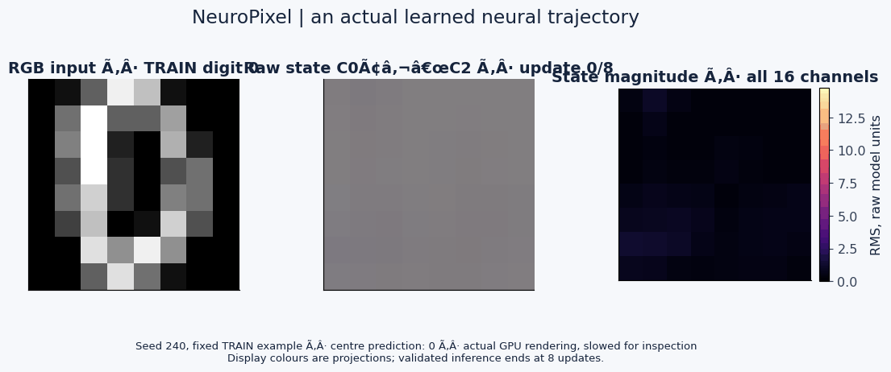
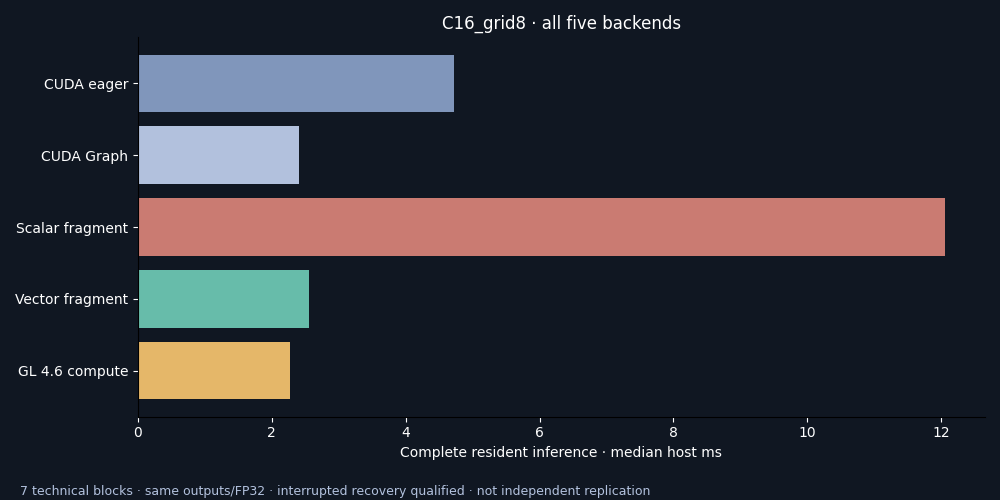
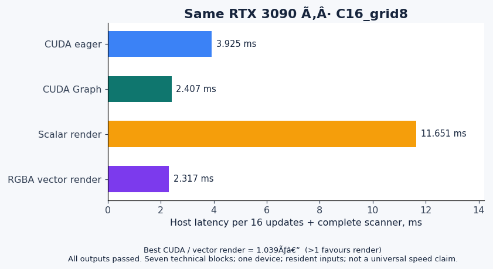
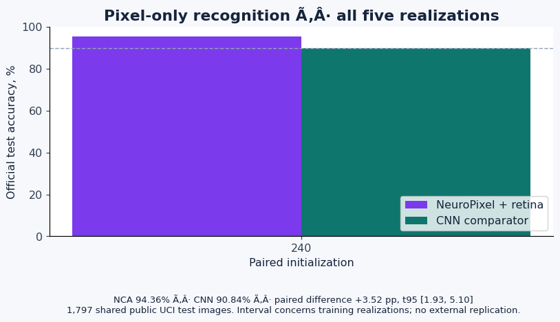
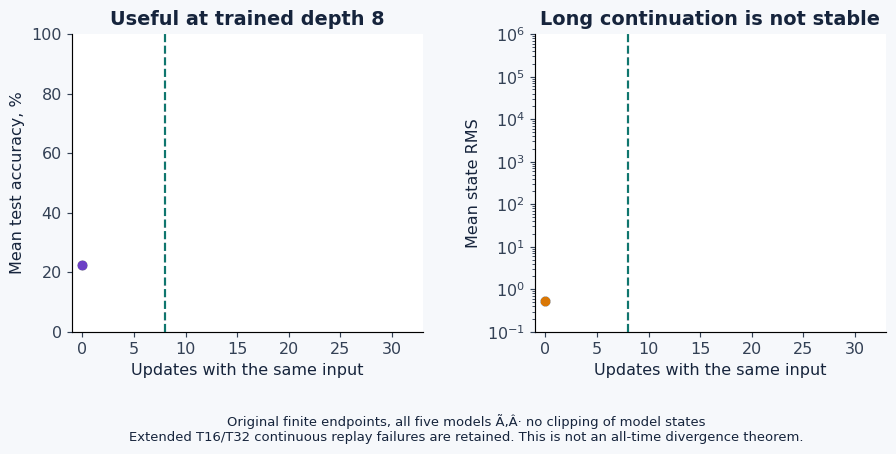

# NeuroPixel

### Neural fields executed as images — visible states, measured results

NeuroPixel represents a recurrent neural state on a spatial canvas. Local learned updates evolve the field; a shared dictionary reads the result. The graphics implementation executes perception, local updates, retina and decoding through floating-point image passes. It provides an inspectable artificial neural process, rather than a claim of a biological brain or a complete causal explanation.

**Actual GPU-rendered states**, selected VIS07 model, registered seed240 and fixed original TRAIN digit0. Playback is slowed for inspection. Colours display a projection of raw channels; magnitude is shown separately. The validated classifier uses eight updates and resets for each new input.

## What is demonstrated

| Question | Complete measured result | Evidence and scope |
|---|---|---|
| Can rendering reproduce the neural computation? | **136 engineering checks passed on RTX3090**, including pixel retina, state updates, masks, full logits and decisions. Learned deployment also retained all **320 tested decisions** across five models. | [GPU fidelity](docs/research/REPRODUCE_20261009.md); FP32, fixed checks and explicit subset. |
| Does an external pixel-only task work? | **94.36%** NeuroPixel versus **90.84%** CNN; paired difference **+3.52pp**, exploratory t95 **[1.93,5.10]pp**. | [VIS07](docs/research/VIS07_results.md): five paired fits, official UCI test1797images, DEV-only selection, near nominal parameter counts, differing functions/costs. |
| Can graphics execution be faster? | RGBA vector rendering measured **1.536×** relative to the best CUDA comparator for C16/grid128. Other workloads do not uniformly win. | [RENDER09](docs/research/RENDER09_results.md): same GPU/outputs/FP32, CUDAeager andCUDAgraph, all seven workloads shown. |
| Does query-dependent spatial reading help binding? | GLOB05 attention minus active global uniform control **+6.28pp**, exploratory IC95 **[4.11,8.45]pp**. | [GLOB05](docs/research/GLOB05_results.md): twelve fixed bodies, equal registered budget/supervision; internal development, not external replication. |
| Are the negative results preserved? | Yes. OriginalH1 remains unsupported; DEV04 original precision target failed; long continuations are not stable. | [DEV04](docs/research/DEV04_results.md), [historical audit](docs/research/TASK4_historical_capabilities_audit_20261009.md), [limits](docs/research/COST_AND_LIMITS_20261009.md). |

These are results of the specified recipes and device. They do not establish general architectural superiority, independent external replication or a Nobel-level discovery.

## Graphics backends and fair acceleration controls

The original scalar renderer uses RGBA32F textures and framebuffer passes. The vector renderer packs coefficients and performs four-channel fetches/DOT4. The advanced OpenGL 4.6 backend uses compute shaders, SSBO weights and shared pixel tiles. Its complete comparison passed **77 output gates and all 245 timing rows**, preserving the original 143 rows without repeating them. Compute measures **2.084×** relative to the best CUDA comparator for C16/grid128, and loses for C48/grid128. Recovery interrupted measurement sessions; results are descriptive technical measurements, not independent replications. [All RENDER10 cases and limits](docs/research/RENDER10_results.md).

The first scalar implementation was **3.14–12.25× slower** than the best measured CUDA comparator. It is retained as a within-run control. The vector variant improves that implementation; advantages are workload-dependent. CUDA Graph is included to reduce avoidable Python launch overhead. Technical timing blocks are not independent scientific replications.

Timing uses resident inputs, sixteen updates and the complete scanner. Setup/compilation, transfers, training and archival are distinct costs. Short NVML counter deltas cannot establish per-inference energy savings; zero readings are not zero consumption. Whole-system wall energy has not been measured.

## End-to-end visual learning

RGB pixels feed a learned retina, neural state and shared decoder. No target label or class token is inserted as image input. Five new pairs received the same training examples, orders, labels and forty-epoch budget. Ten DEV-selected models were sealed before official test scoring. Code and original weights are preserved; inference can run through graphics, while this study's training used PyTorchCPU.

The corpus is public UCI optical digits. The metadata documents separate writers for official TRAIN/TEST; exact input-image identities were disjoint. It is a bounded recognition benchmark, not natural-language reasoning, blind custody or independent laboratory confirmation. NCAclassification and WebGL execution have [primary antecedents](https://distill.pub/2020/growing-ca/).

## Time, stability and honest introspection

Eight updates are trained. Extending the same input to sixteen or thirty-two updates degrades accuracy and grows the recorded state magnitude. Ten extended-logit comparisons failed the original replay tolerance and remain archived, even though categorical decisions matched. A fixed same-host128-row diagnostic reproduced both code paths and archived values; it does not erase the earlier failed execution.

The scanner projects state through a learned decoder. [SCN06](docs/research/SCN06_results.md) demonstrates that identical present displays can hide state differences that affect a future answer. Seeing a colour is useful observability, not unique causal circuit identification or biological equivalence.

## Reproduce and inspect every result

An [interactive local viewer](docs/research/VIS07_viewer.md) exposes all sixteen raw channels, selectable RGB projection, per-cell decoder probabilities and reset/depth controls. Archive mode passed fifty HTTP checks and browser controls. Live physical GPU integration passed **27 trajectory gates plus 52 HTTP checks**, including all ten TRAIN resets and clean release. A separate CPU/Mesa execution passed the same integration checks; software and archive modes are labelled explicitly and are not presented as physical GPU execution.

The [sustained energy protocol](docs/research/RENDER11_energy_protocol.md) uses actual board counters over multi-second blocks. Its original execution passed all 77 output gates and preserved 100/105 blocks before the unchanged RAM floor stopped it. Complete comparative energy conclusions remain pending; full wall energy is unmeasured.

- [Reproduction instructions and environments](docs/research/REPRODUCE_20261009.md)
- [All-study evidence index](docs/research/RESULTS_INDEX_20261009.md)
- [Scientific manuscript: methods, results and open requirements](docs/papers/NeuroPixel_manuscript_20261009.md)
- Frozen plans, original checkpoints, datasets, raw predictions/states, failed attempts and hash manifests under `results/research/`.
- Scientific animation provenance: [manifest](docs/animations/manifest.json). Animations derive from actual data; no synthetic brain artwork.
- Original README and prior versions are retained in the archive and Git history.

CPU studies used Python3.12.14/Torch2.6.0+cpu, two threads and a minimum8GiB availableRAM. GPU tests used RTX3090/NVIDIA581.29, Torch2.6.0+cu124 and ModernGL5.12/glcontext3. Training and heavy neural loading require the resource guard and shared GPU queue. Never rerun closed fits to improve an interval.

## License and attribution

Code: [MIT](LICENSE). Optical-digits data: Alpaydin & Kaynak(1998), [UCI DOI10.24432/C50P49](https://archive.ics.uci.edu/dataset/80/optical+recognition+of+handwritten+digits), CC BY4.0. Historical bAbI data: Weston and colleagues; the [publisher dataset card](https://huggingface.co/datasets/facebook/babi_qa/blob/main/README.md) declares CC BY3.0. The historical acquisition report retains its mirror and upstream-checksum limitations. Third-party sources and internal reproduction are explicitly distinguished. Independent replication, full energy accounting, broad stable memory and exceptional original utility remain open research requirements.
