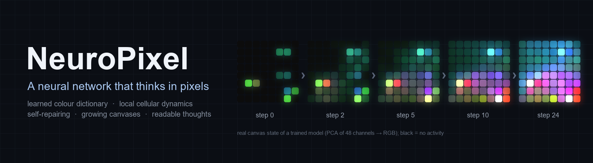
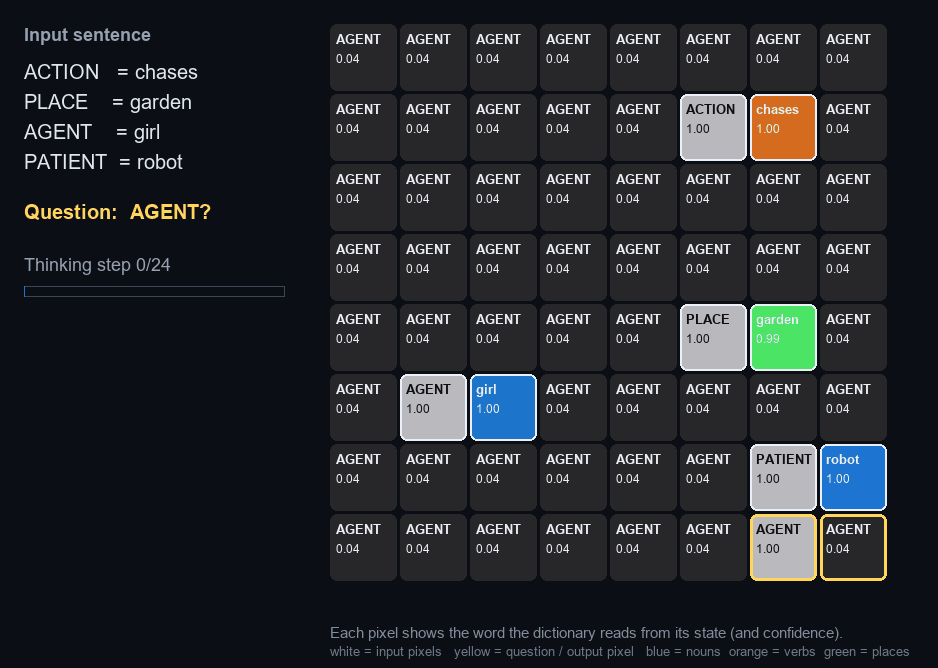
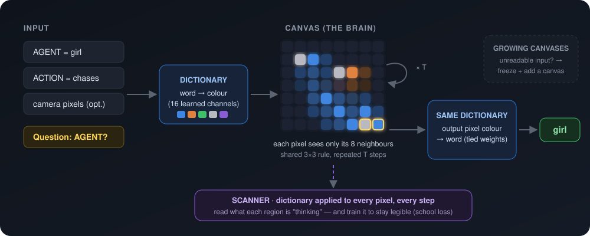
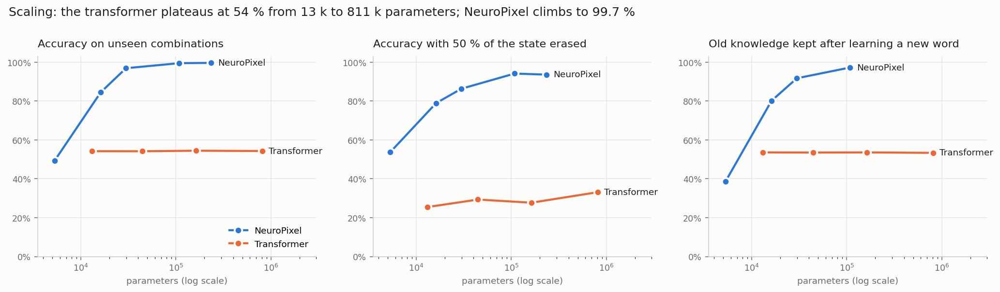
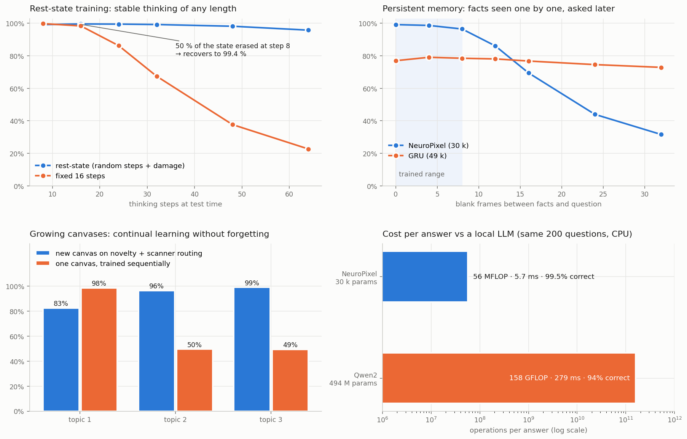

<p align="center">
  
</p>

<p align="center">
  <a href="LICENSE"></a>
  
  
  
  
</p>

<p align="center">
  <b>A neural network whose entire state lives on a canvas of pixels.</b><br>
  Words become learned colours · a local cellular rule does the thinking · the same dictionary reads the answer back.<br>
  Every step of the reasoning is visible — and decodable pixel by pixel.
</p>

---

## Watch it think

<p align="center">
  
</p>

A sentence it has **never seen** is written on an 8×8 canvas as role/word pixel pairs. A question pixel asks
*"who is the AGENT?"*. For 24 steps each pixel only talks to its 8 neighbours. The **dictionary scanner** decodes what
every pixel is "thinking" at every step. The input pixels keep saying their own word, activity flows towards the
output pixel, and the output pixel ends up saying **girl** — the right answer.

## How it works

<p align="center">
  
</p>

| Ingredient | What it does |
|---|---|
| **Colour dictionary** | Each token gets a learned 16-channel "colour". The same table is used to write the input and to read the output (tied weights). Empty pixels are black and carry no activity. |
| **Canvas dynamics** | A single shared 3×3 rule (depthwise perception + 1×1 MLP, residual, stochastic updates) runs for *T* steps. No attention, no global pooling. |
| **School loss** | Every input pixel must keep "saying" its own word through the dictionary. The canvas stays legible and learns faster. |
| **Rest-state training** | Random number of steps + random damage during training → dynamics that are stable for any length and repair themselves. |
| **Growing canvases** | When the current canvases cannot read the input (novelty, ART-like), freeze them and add a new one; route questions with the scanner. |

## Key results

All numbers are on **combinations never seen during training** (synthetic role-binding task). Raw data is in
[`results/`](results) and the full write-up (Spanish) in [`docs/FASE3_CONCLUSIONES.md`](docs/FASE3_CONCLUSIONES.md).

<p align="center">
  
</p>

**Scaling is the headline.** With the same training budget, a transformer stays at **54 %** from 13 k to 811 k
parameters. It learns a shortcut: it memorises which nouns go together and systematically swaps agent and patient.
NeuroPixel climbs from 49 % to **99.7 %**. At 30 k parameters, two seeds give 95.4–98.4 % against 53.8–54.6 %. The
gap *widens* with size, and so does robustness to damage.

<p align="center">
  
</p>

| Capability | NeuroPixel | Baseline |
|---|---|---|
| Unseen combinations (scaling) | 49 % → **99.7 %** (5 k → 236 k params) | Transformer **54 %** flat (13 k → 811 k) |
| Self-repair: 50 % of the state erased mid-thought | **99.4 %** with rest-state training; stable from 8 to 64 steps | Transformer 25–33 % |
| Cost per answer (CPU, same 200 questions) | **56 MFLOP · 5.7 ms · 99.5 %** | Qwen2-494M (3-shot): 158 GFLOP · 279 ms · 94 % |
| New word from 5 examples (one dictionary row trained) | up to 98.6 % new, 92.6 % old kept | Transformer 50–61 % |
| Continual learning, 3 topics in a row | growing canvases **93 %** average | single canvas 66 % (forgets) |
| Persistent memory (facts seen one by one) | **99 %** up to 8 blank frames | GRU 77 % (but decays more slowly) |
| Non-local binding (role and word far apart) | 66 % → 74 % with size + rest-state | Transformer 56 % — **not solved yet** |
| Imagination (fill a masked word) | 100 % plausible category, diverse, not copied | — |

### Why it matters

- **Tiny specialists instead of cannons for flies.** About 2 800× less compute than a small LLM on a bounded task,
  with higher accuracy and a fixed-cost, deterministic answer.
- **Biological-style properties come for free.** Self-repair, arbitrary thinking time, learning a word from a
  handful of examples, and growing new canvases instead of overwriting old knowledge.
- **Interpretable by construction.** The scanner is the model's own read-out, applied everywhere, not a post-hoc probe.

<details>
<summary><b>Honest caveats</b> (please read before citing)</summary>

- Synthetic, small tasks; not yet tested on natural language or large vocabularies.
- Most numbers come from a single seed; the 30 k / 44 k scaling points have two. Claims need ≥ 3 seeds.
- Baselines are small transformers and a GRU trained with the same budget. A transformer with more data, other
  positional encodings or longer training might solve the task.
- Vision: the pure canvas does not perceive CIFAR-10 objects (16–19 %). With a small "retina" front-end it reaches
  42–62 %, against 72–76 % for a CNN. Beating CNNs is *not* the goal.
- Anchoring dictionary colours to real perceptual colours did not transfer zero-shot. The memory decays faster
  than a GRU's. The canvas never returns fully to black (energy savings are partial: −51 % updates, −0.8 pt accuracy).
- A few runs were repeated after fixing bugs; the invalid numbers are excluded and documented in the conclusions.

</details>

## Quick start

```bash
git clone https://github.com/Agnuxo1/NeuroPixel.git
cd NeuroPixel
pip install torch numpy pillow matplotlib pytest
python -m pytest                                        # 13 tests
python scripts/train.py --model neuropixel --iters 2000 # small run on CPU
python scripts/scan.py runs/<run_name>                  # dictionary scanner images
```

<details>
<summary><b>Reproduce the experiments</b></summary>

```bash
python scripts/phase3.py stable --arg reposo      # rest-state training + damage tests
python scripts/phase3.py scale  --arg np30k       # one point of the scaling curve (GPU)
python scripts/phase3.py far    --arg neuropixel  # non-local binding
python scripts/phase3.py memory                   # persistent memory vs GRU
python scripts/phase3.py grow2                    # growing canvases by novelty
python scripts/phase3.py llm                      # cost vs a local GGUF LLM (llama-cpp-python)
python scripts/night.py --k 6                     # whole battery as a GPU queue with a temperature watchdog
python scripts/report_phase3.py                   # rebuild results/phase3 report
python scripts/make_readme_figures.py             # rebuild the figures of this README
python scripts/prepare_cifar.py                   # CIFAR-10 for the vision experiments
```

`neuropixel/safety.py` keeps the machine usable: CPU by default, GPU only if it is actually free, a VRAM cap per
process, low process priority and a RAM floor.

</details>

## Repository map

```
neuropixel/   model.py (NeuroPixel, Retina, TinyTransformer) · task.py · phase3.py · cartilla.py
              scanner.py · codec.py (token ↔ RGB24 pixel) · hrr.py · safety.py
scripts/      train.py · train_cartilla.py · battery.py · phase3.py · night.py · sweep.py
              scan.py · eval_roles.py · report_phase3.py · make_readme_figures.py · prepare_cifar.py
results/      raw JSON of every experiment, reports and plots
docs/         conclusions (Spanish) and figures · ROADMAP.md (curriculum and work lines)
tests/        13 unit tests
```

## Roadmap

- [x] Trainable end to end, learned colour dictionary, dictionary scanner
- [x] Self-repair, rest-state dynamics, growing canvases, few-shot words, cost vs LLM
- [ ] ≥ 3 seeds for every key claim
- [ ] Solve non-local binding (larger canvases, longer training)
- [ ] Memory consolidation layer (retain like a GRU, keep NeuroPixel's precision)
- [ ] Curriculum: words → images → video (see [ROADMAP.md](ROADMAP.md))
- [ ] Photonic simulation of the canvas

## Citation

```bibtex
@software{angulo_neuropixel_2026,
  author  = {Angulo de Lafuente, Francisco},
  title   = {NeuroPixel: a neural network that thinks in pixels},
  year    = {2026},
  url     = {https://github.com/Agnuxo1/NeuroPixel},
  license = {MIT}
}
```

## License

Released under the [MIT License](LICENSE). © 2026 Francisco Angulo de Lafuente.
