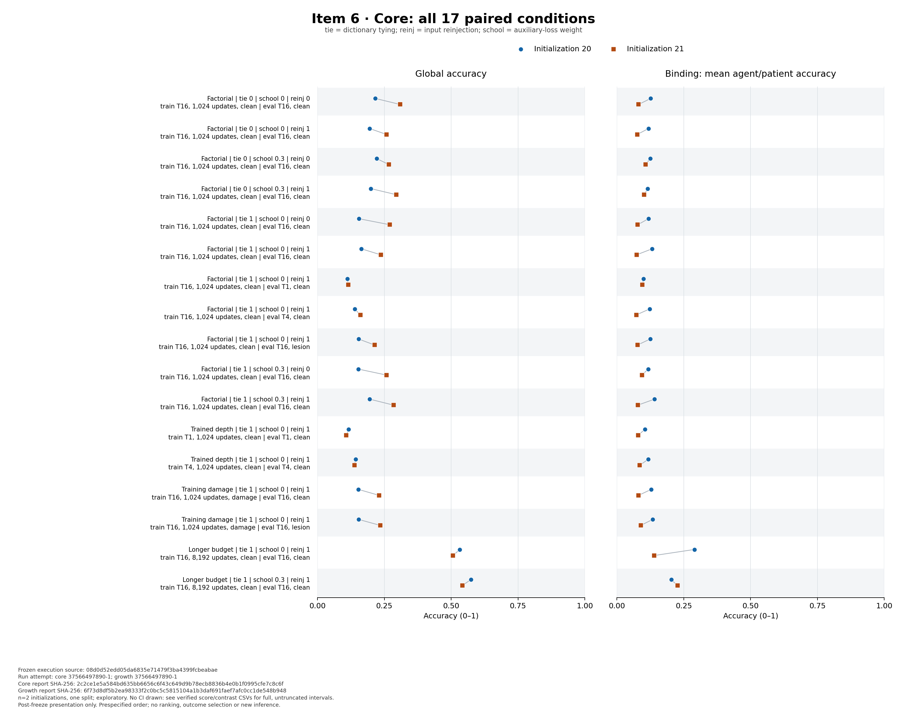
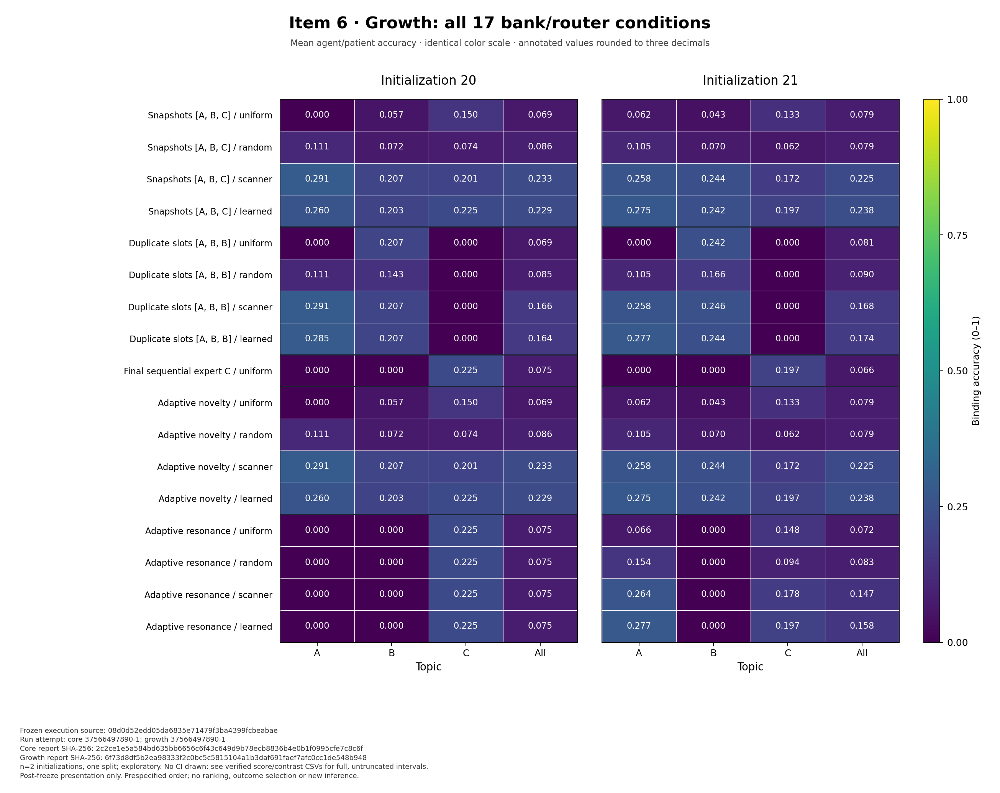

# Item 6 — Component attribution and expert-growth study

**Completed investigation — all declared execution, recounts and final report review passed.**  
**Scope:** exploratory item 6 on one split and two paired initializations.  
**Study date:** 2026-10-07. The report framework was prepared after the execution freeze, before outcome inspection, and populated from verified saved results.

## 1. Question and result statement

We examine dictionary tying, intermediate token supervision (“school”), input reinjection, recurrent depth, training damage and expert-bank growth in the implemented synthetic role-binding task. The [amendment](06_protocol_amendment.md), [core inventory](06_core_inventory.json), [growth inventory](06_growth_inventory.json) and [execution plan](06_execution_plan.json) define the comparisons. The [original protocol](02_protocol.md) and [protocol JSON](protocol.json) remain unchanged.

**Core result.** Increasing the budget from 1,024 to 8,192 updates improved final agent/patient binding in all four declared seed-by-school comparisons, but the longer runs reached only 13.9648–28.9551% binding. Every one of the 26 training probes remained below the prespecified 95% flag threshold. Component effects depended on initialization and factorial background; all 38 paired core contrast intervals included zero. Their width does not establish equivalence or absence of effects. This panel does not identify a unique cause of limited learning.

**Growth result.** On the identical [A,B,C] expert bank, scanner selection exceeded random expert selection in binding for both seeds: the mean paired difference was 14.6159 percentage points, with unadjusted t95 [13.3750,15.8567]. Absolute scanner binding was 23.3073% and 22.4609%. The learned mixture gave 22.9167% and 23.8281% binding and higher global accuracy than the scanner in both seeds. Adaptive novelty reproduced the fixed bank's recorded identities and scores; resonance retained one expert for seed20 and two for seed21. Capacity, retention, routing and additional supervised fitting therefore remain distinct explanations. The low absolute binding and the lexical topic cue prevent treating these results as demonstrated general role binding or autonomous growth.

**H1 remains closed and not supported**, as reported in [item 5](05_results_recovered_20261007.md). No configuration is selected from item-6 final scores. Full per-role and per-topic results, uncertainty and negative comparisons accompany the positive routing observations.

| Evidence anchor | Value |
|---|---|
| Amendment / freeze | NP-SCI-20261006-v1-A06 / 2026-10-07T03:22:22Z |
| [Execution commit](https://github.com/Agnuxo1/NeuroPixel/tree/08d0d52edd05da6835e71479f3ba4399fcbeabae) | `08d0d52edd05da6835e71479f3ba4399fcbeabae` |
| Plan blob | `db0b8af857dd7731128de5e7e32de53958beb10a` |
| Plan SHA-256 | `20f4e9b4385c95c5f206ac26702bca96ac4232930ea343fd718c4de5bec6048a` |
| [Actions run](https://github.com/Agnuxo1/NeuroPixel/actions/runs/37566497890) / attempt | 37566497890 / 37566497890-1; completed successfully |
| [Final raw archive](https://github.com/Agnuxo1/NeuroPixel/tree/15e76456bc2b4cce5faec0b08fb5288fe7844547/results/research/06_cloud_runs/37566497890-1) | `15e76456bc2b4cce5faec0b08fb5288fe7844547`; results branch `research/scientific-validation-2026-10-07-cloud-results` |
| Final manifest SHA-256 | `60acc62bf2f2afaf2c79540fb09731a90ef7eb07764b556a63f172c1c9253469` |
| Worker completion / final manifest time | 2026-10-07T05:16:05.490541Z / 2026-10-07T05:16:05.716624Z |
| Core root recount SHA-256 | `2c2ce1e5a584bd635bb6656c6f43c649d9b78ecb8836b4e0b1f0995cfe7c8c6f` |
| Growth root recount SHA-256 | `6f73d8df5b2ea98333f2c0bc5c5815104a1b3daf691faef7afc0cc1de548b948` |
| Final archive audit SHA-256 | `50a0a42742d7198d8c3884215ae54178479f09b1a1db925c32784deec93d048e` |

The exact frozen execution passed 107 implementation tests, with no failures and one unrelated CIFAR-data skip. These checks do not measure learned performance. The [recovery manifest](06_recovery_manifest.json) anchors seven historical scientific source files byte-for-byte and distinguishes the unavailable historical queue worker from the new supervisor. The source ZIP contains all 132 tracked files of the execution commit.

## 2. Methods and statistical units

The core uses an 8×8 canvas, vocabulary 35, split 0 and paired initialization seeds 20/21. Binding is the equal-weight mean of agent and patient accuracy. Preserve global and per-role accuracy and cross-entropy as well. Training uses stochastic firing at rate 0.5; evaluation updates all cells. This training/evaluation difference is inherited and common to the declared comparisons, including the lesion evaluations.

The factorial varies tying A∈{0,1}, school B∈{0,0.3} and reinjection C∈{0,1}: eight corners per seed, 1,024 updates, batch 64, T16 and AdamW LR 0.003. Enabled school observes PRE3/7/11/15. Extensions add separately trained T1/T4, damage training and 8,192-update endpoints; recurrence and damage use school 0. All 26 trainings precede the core gate and 34 final evaluations. Core validation/final/probe sizes are 2,048/4,096/512 with frozen sampling seeds.

Growth filters the existing split pools into three noun-restricted topics A→B→C, without reallocating triples. Fixed sequential, adaptive novelty and adaptive resonance each have two trajectories, three stages of 512 updates, tied decoding, reinjection, school 0.3 and T16. All 18 stages and eight train-only router fits precede the separate growth gate and 34 routing outputs. Two preallocation checks are construction identities, not replications. Both panels were frozen before the first training; core outcomes do not choose growth settings.

Compute contrasts within each seed, then report both values, mean, sample SD, range and untruncated t95 interval: mean ± cot(π×0.025)×SD/√2, n=2, df=1. The normality assumption cannot be assessed meaningfully at n=2. Examples, factorial backgrounds, snapshots and routers do not enlarge n. Retained example-bootstrap intervals concern individual checkpoints and remain distinct from initialization uncertainty.[VARIANCE][TINTERVAL]

## 3. Completeness and independent recount

| Check | Required evidence | Verified result |
|---|---|---|
| Core development | Exact configs, common environment, checkpoints, curves and probe flags | 26/26 trainings complete; no missing or substituted condition |
| Core gate | All development completed before final access | Gate recorded at 04:57:18.820473 UTC; all 26 required runs present |
| Core scoring | Aligned saved predictions; finite confidence/NLL; metrics recounted | 34/34 final outputs; 139,264 final and 53,248 validation prediction records; 244 input-file checks; zero issues |
| Growth development | Trajectories, stages, supervised gates, construction checks | 6/6 trajectories, 18/18 stages, 8/8 gate fits, 2/2 construction checks |
| Growth gate/scoring | Complete development before outputs; decisions and routers audited | Gate at 05:15:33.457661 UTC; 34/34 outputs covering 104,448 routed prediction records; 136 metric rows, 448 contrasts, 178 input-file hashes; zero issues |
| Final archive | Exact source, plan and artifact bytes | 400 listed files, 32,186,488 bytes excluding the manifest, no missing/additional files; 132 source ZIP files identical to the frozen checkout |
| Execution | All declared worker stages succeed | Six stages completed with return code 0; archived logs match; GitHub job reports success |
| Deviations | Stops/retries and affected comparisons retained | One complete scientific attempt; no stopped/replaced training in this attempt; prospective validation failures and operational corrections retained below |

The root [core recount](../../results/research/06_root_review/37566497890-1/core/core_analysis.json) and [growth recount](../../results/research/06_root_review/37566497890-1/growth/06_growth_analysis.json) were produced by the exact frozen analyzers against saved artifacts. [The final integrity receipt](../../results/research/06_root_review/37566497890-1/final_archive_audit.json) additionally verifies every archived file, the source ZIP, the plan, stage logs, JUnit counts and recorded resource limits. The [GitHub status receipt](../../results/research/06_root_review/37566497890-1/github_job_status.json) records the successful job.

The [cross-environment report comparison](../../results/research/06_root_review/37566497890-1/recount_comparison.json), SHA-256 `a240c915c15cfd2d311541ddf7f6e4b560a8a7a1df1e5a0883426760ce0fd7c4`, found exact agreement in 35,964 decoded leaves, including 25,112 numeric values, across the core and growth reports. Only the named audit timestamp and NumPy-version metadata are excluded and retained explicitly. The worker used NumPy 2.2.6 and the root recount NumPy 2.3.5. No rounding or numerical tolerance was used in this comparison. This is the same frozen analyzer in two environments, not an independent second analyzer implementation.

An additional [post-freeze budget-prefix check](../../results/research/06_root_review/37566497890-1/budget_prefix_check.json) compared the four short/long budget pairs at all eight common logging updates and all three retained scalar fields. All 96 values matched exactly. This establishes consistency of those recorded observables, not equality of parameters or optimizer state; no long-run checkpoint at update 1,024 was saved.

These are saved-array recounts and artifact checks, not model reruns or external laboratory replication. Checkpoint bytes are hashed without Torch deserialization. Core probe flags are checked against recorded counts because probe prediction arrays were not saved. Growth audits stored diagnostic probabilities and gate objectives without refitting experts or routers. Repeated predictions on the same examples, checkpoints, routers and policy identities do not enlarge the initialization sample size. Recorded event order is not external proof against every possible unlogged action.

## 4. Core outcomes

### 4.1 Absolute performance and training diagnostics

B0/B1 denote school 0/0.3. All global, per-role and cross-entropy results are retained in the score CSV.

**Verified source:** [core analysis JSON](../../results/research/06_root_review/37566497890-1/core/core_analysis.json), SHA-256 **2c2ce1e5a584bd635bb6656c6f43c649d9b78ecb8836b4e0b1f0995cfe7c8c6f**; raw archive commit **c3f858129f59022dabe75b4f1ebccf32436a19f2**, execution source **08d0d52edd05da6835e71479f3ba4399fcbeabae**. The [complete 34-evaluation score CSV](../../results/research/06_root_review/37566497890-1/core/core_scores.csv) retains unrounded global, per-role, binding and cross-entropy values. The [complete 38-contrast CSV](../../results/research/06_root_review/37566497890-1/core/core_contrasts.csv) retains both seed differences and all summary fields. Displayed accuracy/probe values and their intervals are percentages; contrast values, SDs, ranges and intervals below are percentage points (pp), rounded to six decimals. SD is the sample SD; every paired interval uses n=2 and df=1 and is retained without clipping.

| Training condition | Binding seed 20 / 21 (%) | Mean / sample SD / range (%) | t95, df1 (%) | Probe binding 20 / 21 (%); below-.95 flags |
|---|---|---|---|---|
| A0 B0 C0 | 12.646484 / 8.105469 | 10.375977 / 3.210983 / [8.105469, 12.646484] | [-18.473561, 39.225514] | 11.718750 / 10.937500; yes / yes |
| A0 B0 C1 | 11.816406 / 7.568359 | 9.692383 / 3.003823 / [7.568359, 11.816406] | [-17.295894, 36.680659] | 15.234375 / 10.546875; yes / yes |
| A0 B1 C0 | 12.451172 / 10.693359 | 11.572266 / 1.242961 / [10.693359, 12.451172] | [0.404703, 22.739828] | 11.718750 / 14.453125; yes / yes |
| A0 B1 C1 | 11.523438 / 10.156250 | 10.839844 / 0.966748 / [10.156250, 11.523438] | [2.153962, 19.525726] | 11.718750 / 8.203125; yes / yes |
| A1 B0 C0 | 11.816406 / 7.763672 | 9.790039 / 2.865716 / [7.763672, 11.816406] | [-15.957397, 35.537475] | 9.765625 / 9.765625; yes / yes |
| A1 B0 C1 — clean reference | 13.183594 / 7.373047 | 10.278320 / 4.108677 / [7.373047, 13.183594] | [-26.636679, 47.193319] | 15.625000 / 9.765625; yes / yes |
| A1 B1 C0 | 11.669922 / 9.326172 | 10.498047 / 1.657282 / [9.326172, 11.669922] | [-4.392037, 25.388131] | 12.890625 / 8.593750; yes / yes |
| A1 B1 C1 | 14.062500 / 7.812500 | 10.937500 / 4.419417 / [7.812500, 14.062500] | [-28.769390, 50.644390] | 14.062500 / 10.546875; yes / yes |
| A1 B0 C1, trained T1 | 10.498047 / 7.958984 | 9.228516 / 1.795388 / [7.958984, 10.498047] | [-6.902408, 25.359440] | 8.593750 / 10.546875; yes / yes |
| A1 B0 C1, trained T4 | 11.718750 / 8.496094 | 10.107422 / 2.278762 / [8.496094, 11.718750] | [-10.366443, 30.581287] | 10.937500 / 12.109375; yes / yes |
| A1 B0 C1, damage-trained T16 | 12.841797 / 8.105469 | 10.473633 / 3.349090 / [8.105469, 12.841797] | [-19.616745, 40.564010] | 12.109375 / 10.937500; yes / yes |
| A1 B0 C1, 8,192 updates | 28.955078 / 13.964844 | 21.459961 / 10.599696 / [13.964844, 28.955078] | [-73.774533, 116.694454] | 30.078125 / 15.234375; yes / yes |
| A1 B1 C1, 8,192 updates | 20.312500 / 22.656250 | 21.484375 / 1.657282 / [20.312500, 22.656250] | [6.594291, 36.374459] | 17.187500 / 25.781250; yes / yes |

Across the eight 1,024-update factorial conditions, mean binding accuracy ranged from 9.6924% to 11.5723%; individual seed scores ranged from 7.3730% to 14.0625%. All 26 runs retained the below-95% probe flag, with recorded probe binding between 8.2031% and 30.0781%. These comparisons therefore concern a low absolute-binding regime, including the longer-budget runs. The flag describes observed probe performance; it does not identify its cause, establish convergence, or show that further optimization would necessarily resolve the limitation.

### 4.2 Factorial attribution

Main effects average high-minus-low differences over the other factors. Pair interactions average differences-in-differences; the three-way interaction differences those pair effects. These are raw contrasts, not ±1-regression coefficients.[FACTORIAL]

| Contrast | Δ20 / Δ21 (pp) | Mean / sample SD / range (pp) | t95, df1 (pp) |
|---|---|---|---|
| Tying A | +0.573730 / -1.062012 | -0.244141 / 1.156644 / [-1.062012, +0.573730] | [-10.636178, +10.147897] |
| School B | +0.061035 / +1.794434 | +0.927734 / 1.225698 / [+0.061035, +1.794434] | [-10.084723, +11.940192] |
| Reinjection C | +0.500488 / -0.744629 | -0.122070 / 0.880431 / [-0.744629, +0.500488] | [-8.032427, +7.788287] |
| A×B | +0.610352 / -1.586914 | -0.488281 / 1.553701 / [-1.586914, +0.610352] | [-14.447735, +13.471172] |
| A×C | +2.758789 / -0.415039 | +1.171875 / 2.244235 / [-0.415039, +2.758789] | [-18.991780, +21.335530] |
| B×C | +0.463867 / -0.561523 | -0.048828 / 0.725061 / [-0.561523, +0.463867] | [-6.563240, +6.465583] |
| A×B×C | +1.123047 / -1.123047 | 0.000000 / 1.588228 / [-1.123047, +1.123047] | [-14.269664, +14.269664] |

All 18 conditional contrasts are retained in the verified CSV and displayed here with the same seedwise values and summary fields:

| Conditional contrast | Δ20 / Δ21 (pp) | Mean / sample SD / range (pp) | t95, df1 (pp) |
|---|---|---|---|
| A at B0 C0 | -0.830078 / -0.341797 | -0.585938 / 0.345267 / [-0.830078, -0.341797] | [-3.688038, +2.516163] |
| A at B0 C1 | +1.367188 / -0.195312 | +0.585938 / 1.104854 / [-0.195312, +1.367188] | [-9.340785, +10.512660] |
| A at B1 C0 | -0.781250 / -1.367188 | -1.074219 / 0.414320 / [-1.367188, -0.781250] | [-4.796740, +2.648302] |
| A at B1 C1 | +2.539062 / -2.343750 | +0.097656 / 3.452670 / [-2.343750, +2.539062] | [-30.923351, +31.118664] |
| B at A0 C0 | -0.195312 / +2.587891 | +1.196289 / 1.968022 / [-0.195312, +2.587891] | [-16.485685, +18.878263] |
| B at A0 C1 | -0.292969 / +2.587891 | +1.147461 / 2.037075 / [-0.292969, +2.587891] | [-17.154934, +19.449855] |
| B at A1 C0 | -0.146484 / +1.562500 | +0.708008 / 1.208434 / [-0.146484, +1.562500] | [-10.149345, +11.565360] |
| B at A1 C1 | +0.878906 / +0.439453 | +0.659180 / 0.310740 / [+0.439453, +0.878906] | [-2.132711, +3.451070] |
| C at A0 B0 | -0.830078 / -0.537109 | -0.683594 / 0.207160 / [-0.830078, -0.537109] | [-2.544854, +1.177667] |
| C at A0 B1 | -0.927734 / -0.537109 | -0.732422 / 0.276214 / [-0.927734, -0.537109] | [-3.214102, +1.749259] |
| C at A1 B0 | +1.367188 / -0.390625 | +0.488281 / 1.242961 / [-0.390625, +1.367188] | [-10.679282, +11.655844] |
| C at A1 B1 | +2.392578 / -1.513672 | +0.439453 / 2.762136 / [-1.513672, +2.392578] | [-24.377353, +25.256259] |
| A×B at C0 | +0.048828 / -1.025391 | -0.488281 / 0.759587 / [-1.025391, +0.048828] | [-7.312903, +6.336340] |
| A×B at C1 | +1.171875 / -2.148438 | -0.488281 / 2.347815 / [-2.148438, +1.171875] | [-21.582566, +20.606004] |
| A×C at B0 | +2.197266 / +0.146484 | +1.171875 / 1.450121 / [+0.146484, +2.197266] | [-11.856948, +14.200698] |
| A×C at B1 | +3.320312 / -0.976562 | +1.171875 / 3.038349 / [-0.976562, +3.320312] | [-26.126612, +28.470362] |
| B×C at A0 | -0.097656 / 0.000000 | -0.048828 / 0.069053 / [-0.097656, 0.000000] | [-0.669248, +0.571592] |
| B×C at A1 | +1.025391 / -1.123047 | -0.048828 / 1.519175 / [-1.123047, +1.025391] | [-13.698071, +13.600415] |

**Interpretation:** Average tying and reinjection effects changed sign between seeds. School averaged positive effects in both seeds (+0.0610 and +1.7944 pp), but its conditional effect was negative in three of four backgrounds for seed 20 and positive in all four for seed 21. Without tying, reinjection reduced binding in both seeds at both school levels; with tying, its direction differed between seeds. All seven overall and all 18 conditional factorial intervals included zero. The three-way interaction averaged exactly zero because its seed-level values were equal and opposite (+1.123046875 and −1.123046875 pp); that cancellation is not evidence that the interaction is absent. These patterns limit a package-wide component summary and do not establish a broadly reproducible advantage or disadvantage. Tying changes free parameters and gradients; school changes the objective; reinjection changes repeated input access while preserving seeding. Effects concern those implemented interventions. They do not uniquely explain historical performance. Embedding tying and intermediate supervision already have primary precedents.[TYING][DSN]

The tied core has 29,824 nominal trainable parameters; the independent output dictionary adds 35×16=560, yielding 30,384. Disabling reinjection preserves tensor shapes and nominal parameter counts, but 128×16=2,048 weights in the identity-input portion of f1 then multiply identically zero inputs. Those coordinates receive no task gradient through that input, although weight decay may change them. Equal nominal counts therefore do not imply equal active functional capacity.

Every arm retains the historical PAD implementation (`freeze_pad=False`). This panel does not test a corrected PAD mechanism or establish that empty cells remain inactive. Interventions can alter the loss paths reaching the PAD dictionary row, so the measured intervention includes those paths in this implementation.

### 4.3 Trained depth and same-checkpoint truncation

Absolute same-checkpoint deployment scores complete the paired score inventory alongside the trained endpoints in §4.1 and lesion cells in §4.4.

| Deployment condition | Binding 20 / 21 (%) | Mean / sample SD / range (%) | t95, df1 (%) |
|---|---|---|---|
| T16-trained checkpoint evaluated at T1 | 9.960938 / 9.472656 | 9.716797 / 0.345267 / [9.472656, 9.960938] | [6.614696, 12.818898] |
| T16-trained checkpoint evaluated at T4 | 12.255859 / 7.226562 | 9.741211 / 3.556250 / [7.226562, 12.255859] | [-22.210427, 41.692849] |

| Binding contrast | Δ20 / Δ21 (pp) | Mean / sample SD / range (pp) | t95, df1 (pp) |
|---|---|---|---|
| Separately trained T1 − trained T16 | -2.685547 / +0.585938 | -1.049805 / 2.313289 / [-2.685547, +0.585938] | [-21.833880, +19.734270] |
| Separately trained T4 − trained T16 | -1.464844 / +1.123047 | -0.170898 / 1.829915 / [-1.464844, +1.123047] | [-16.612032, +16.270236] |
| Same T16 weights: eval T1 − eval T16 | -3.222656 / +2.099609 | -0.561523 / 3.763410 / [-3.222656, +2.099609] | [-34.374422, +33.251375] |
| Same T16 weights: eval T4 − eval T16 | -0.927734 / -0.146484 | -0.537109 / 0.552427 / [-0.927734, -0.146484] | [-5.500471, +4.426252] |

**Interpretation:** Separately trained T1 and T4 reduced binding relative to T16 for seed 20 and increased it for seed 21. T1 deployment truncation also changed direction between seeds; T4 truncation slightly reduced binding in both (−0.927734 and −0.146484 pp). All four intervals included zero. These results establish neither horizon equivalence nor that recurrence is unnecessary. Training horizon and inference truncation answer different questions. Depth also changes spatial reach, compute and optimization; it does not isolate sharing from a matched feed-forward architecture. Equal firing seeds across different T do not pair masks per minibatch.

**Structural reach (derived from the frozen source, not an outcome analysis).** Pointwise seeding, reinjection and readout, with one 3×3 perception per update, limit dependence on each example's input to Chebyshev distance at most T from the output at (7,7). A queried role/filler pair occupies (r,c)/(r,c+1), with each r,c marginally uniform in {0,…,6}. At T1, the filler lies within that region for 2/49 placements and both role and filler for 1/49; at T4 these proportions are 20/49 and 16/49. At T7 the entire canvas is structurally reachable. This counts possible information paths, not learned transport or accuracy: guesses, learned priors and other visible clues can produce correct answers, and reaching the region does not ensure successful binding. Distinct rows constrain the four pairs jointly but do not change these marginal fractions. This source-only derivation was added after launch, before reading study outcomes, to interpret the already frozen depth comparisons; it adds no endpoint or experiment.

### 4.4 Training damage × evaluation lesion

Training applies the frozen batch probability 0.5 and cell-erasure probability 0.3 after update 8. A selected cell loses all 48 state channels once; visible tokens, input identities and weights remain available. Evaluation always applies a common example-indexed lesion mask where declared, under full firing.

| Training | Evaluation | Binding 20 / 21 (%) | Mean / sample SD / range (%) | t95, df1 (%) |
|---|---|---|---|---|
| Clean | Clean | 13.183594 / 7.373047 | 10.278320 / 4.108677 / [7.373047, 13.183594] | [-26.636679, 47.193319] |
| Clean | Lesion | 12.451172 / 7.714844 | 10.083008 / 3.349090 / [7.714844, 12.451172] | [-20.007370, 40.173385] |
| Damage | Clean | 12.841797 / 8.105469 | 10.473633 / 3.349090 / [8.105469, 12.841797] | [-19.616745, 40.564010] |
| Damage | Lesion | 13.378906 / 8.886719 | 11.132812 / 3.176456 / [8.886719, 13.378906] | [-17.406515, 39.672140] |

| Binding contrast | Δ20 / Δ21 (pp) | Mean / sample SD / range (pp) | t95, df1 (pp) |
|---|---|---|---|
| Damage − clean training, clean evaluation | -0.341797 / +0.732422 | +0.195312 / 0.759587 / [-0.341797, +0.732422] | [-6.629309, +7.019934] |
| Damage − clean training, lesion evaluation | +0.927734 / +1.171875 | +1.049805 / 0.172633 / [+0.927734, +1.171875] | [-0.501246, +2.600855] |
| Lesion − clean evaluation, clean training | -0.732422 / +0.341797 | -0.195312 / 0.759587 / [-0.732422, +0.341797] | [-7.019934, +6.629309] |
| Lesion − clean evaluation, damage training | +0.537109 / +0.781250 | +0.659180 / 0.172633 / [+0.537109, +0.781250] | [-0.891871, +2.210230] |
| Interaction: damage-trained lesion effect − clean-trained lesion effect | +1.269531 / +0.439453 | +0.854492 / 0.586954 / [+0.439453, +1.269531] | [-4.419079, +6.128063] |

**Interpretation:** Under lesion evaluation, damage-trained checkpoints exceeded clean-trained checkpoints in both seeds (+0.927734 and +1.171875 pp), averaging +1.049805 pp with t95 [−0.501246, +2.600855]. The damage-by-lesion interaction was also positive in both (+1.269531 and +0.439453 pp), with mean +0.854492 pp and t95 [−4.419079, +6.128063]. Clean-evaluation effects of damage training differed in direction between seeds. All five damage intervals included zero, and the four absolute-cell means remained between 10.0830% and 11.1328%. This is a small descriptive robustness pattern, not established learned self-repair. A positive interaction indicates a less adverse lesion effect, not necessarily high absolute accuracy. Only final T16 robustness is observed; no temporal recovery curve is measured. Reinjection keeps the input available, so autonomous regeneration or intrinsic persistent memory is not established. NCA regeneration work motivates the test, not its eventual outcome.[GROWING]

### 4.5 Budget × school

| Binding contrast at A1 C1, T16 | Δ20 / Δ21 (pp) | Mean / sample SD / range (pp) | t95, df1 (pp) |
|---|---|---|---|
| 8,192 − 1,024 updates, school 0 | +15.771484 / +6.591797 | +11.181641 / 6.491019 / [+6.591797, +15.771484] | [-47.137854, +69.501135] |
| 8,192 − 1,024 updates, school 0.3 | +6.250000 / +14.843750 | +10.546875 / 6.076699 / [+6.250000, +14.843750] | [-44.050098, +65.143848] |
| Budget×school difference-in-differences | -9.521484 / +8.251953 | -0.634766 / 12.567718 / [-9.521484, +8.251953] | [-113.551233, +112.281702] |
| School 0.3 − 0 at 8,192 updates | -8.642578 / +8.691406 | +0.024414 / 12.256978 / [-8.642578, +8.691406] | [-110.100163, +110.148991] |

The 1,024-update school comparison is already a factorial conditional contrast. The complete core ledger contains **25 factorial + four depth + five damage + four budget = 38 contrasts**.

**Optimization interpretation:** Increasing the budget improved binding in all four prespecified seed-by-school pairs. Probe binding and validation binding also increased in every corresponding pair, while the recorded final-window total training objective decreased. This is descriptive sensitivity to the declared increase in optimization and exposure, with very wide initialization-level intervals. At 8,192 updates, binding was 28.9551% and 13.9648% without school and 20.3125% and 22.6563% with school, for seeds 20 and 21 respectively. The school effect reversed direction (−8.642578 and +8.691406 pp), averaging +0.024414 pp; the budget-by-school interaction likewise changed sign. All four budget-related intervals included zero, and the longer runs remained below the probe threshold. The below-.95 flag does not prove the cause of success or failure. A budget effect demonstrates sensitivity to the declared eightfold exposure change; its absence does not prove convergence or universal ineffectiveness.

At 8,192 updates, global accuracy reached 50.7080–57.3730%, while binding was 13.9648–28.9551%. The higher action and location accuracies must remain visible alongside agent–patient results in the complete score CSV. Probability quality did not improve uniformly: without school, seed 20's test cross-entropy rose from 2.598731 to 2.687961 despite improved accuracy. The longer-budget outcomes do not establish that insufficient budget is the sole explanation for earlier performance. None of the 38 prespecified core-contrast intervals excluded zero; their width and n=2 do not establish equivalence or universal absence of effects.

Core curves contain a 128-update-window mean of total objective and a last-update answer loss. They cannot be subtracted to reconstruct school loss. Growth stores answer/school/total values from the same sampled update, as point values. Longer-budget outcomes neither establish a matched-budget architecture advantage nor rescue H1.

The figure retains all 17 paired evaluation conditions; [PDF version](../../results/research/06_root_review/37566497890-1/figures_final/06_core_paired_scores.pdf). The complete numerical tables and intervals are available in the [presentation appendix](06_results_tables.md).

## 5. Growth, capacity and routing

The [verified growth recount](../../results/research/06_root_review/37566497890-1/growth/06_growth_analysis.json) reports zero issues for all 6 trajectories, 18 training stages, 8 fitted gates, 34 routing outputs and 2 construction-equivalence checks. It preserves 136 metric rows, 448 paired contrast rows and 178 input-file hashes. Source report SHA-256: `6f73d8df5b2ea98333f2c0bc5c5815104a1b3daf691faef7afc0cc1de548b948`; execution source: `08d0d52edd05da6835e71479f3ba4399fcbeabae`; immutable final raw archive: `15e76456bc2b4cce5faec0b08fb5288fe7844547`. The independently executed root and worker recounts agree numerically. This is a recount of saved evidence, not a new training replication.

### 5.1 Trajectories and adaptive decisions

| Policy / seed | A/B/C assignments; create/revisit history | Final K / unique recorded identities | Threshold and saved lineage |
| --- | --- | --- | --- |
| Fixed sequential / 20 | A: create 0; B: create 1 from 0; C: create 2 from 1 | 3 / 3 | Prescribed lineage 0→1→2; no trigger threshold. |
| Fixed sequential / 21 | A: create 0; B: create 1 from 0; C: create 2 from 1 | 3 / 3 | Prescribed lineage 0→1→2; no trigger threshold. |
| Adaptive novelty / 20 | A: create 0; B: create 1 from 0; C: create 2 from 1 | 3 / 3 | Threshold 0.1; same recorded ordered tensor fingerprints as fixed [A,B,C]. |
| Adaptive novelty / 21 | A: create 0; B: create 1 from 0; C: create 2 from 1 | 3 / 3 | Threshold 0.1; same recorded ordered tensor fingerprints as fixed [A,B,C]. |
| Adaptive resonance / 20 | A: create 0; B: update 0; C: update 0 | 1 / 1 | Fixed τ=0.7434780299663544; final recorded fingerprint matches fixed C. |
| Adaptive resonance / 21 | A: create 0; B: create 1 from 0; C: update 1 | 2 / 2 | Fixed τ=0.6934574246406555; final recorded ordered fingerprints match fixed [A,C]. |

Expert indices are zero-based. All six trajectories create expert 0 at A. Adaptive novelty creates at B and C for both seeds. Resonance updates the single expert at B and C for seed20; for seed21 it creates expert 1 at B and updates that expert at C, retaining expert 0. There are no tied extrema in these adaptive decisions. The following table includes every adaptive B/C decision; margins are positive exactly when the strict creation comparison passes. Novelty margins are score−0.1; resonance margins are τ−score. Values displayed as six decimals do not drive the replay.

| Policy / seed / stage | Raw candidate scores | round4 scores | Threshold | Raw margin | Rounded margin | Decision |
| --- | --- | --- | --- | --- | --- | --- |
| novelty / 20 / B | 0.222439 | 0.2224 | 0.100000 | 0.122439 | 0.122400 | create 1; parent 0 |
| novelty / 20 / C | 0.220052, 0.185330 | 0.2201, 0.1853 | 0.100000 | 0.085330 | 0.085300 | create 2; parent 1 |
| resonance / 20 / B | 0.774004 | 0.7740 | 0.743478 | -0.030526 | -0.030522 | update 0; parent 0 |
| resonance / 20 / C | 0.797236 | 0.7972 | 0.743478 | -0.053758 | -0.053722 | update 0; parent 0 |
| novelty / 21 / B | 0.297743 | 0.2977 | 0.100000 | 0.197743 | 0.197700 | create 1; parent 0 |
| novelty / 21 / C | 0.288845, 0.244575 | 0.2888, 0.2446 | 0.100000 | 0.144575 | 0.144600 | create 2; parent 1 |
| resonance / 21 / B | 0.690890 | 0.6909 | 0.693457 | 0.002568 | 0.002557 | create 1; parent 0 |
| resonance / 21 / C | 0.693306, 0.752250 | 0.6933, 0.7523 | 0.693457 | -0.058793 | -0.058843 | update 1; parent 1 |

The seed21 resonance decision at B is close to its inherited threshold: the raw margin is `0.0025675296783447266` and the rounded-score margin is `0.002557424640655559`. Rounding changes none of the eight create/update comparisons in this run. This observed margin does not establish stability to a different diagnostic sample, threshold or initialization. The maximum absolute difference in the 19 diagnostic scanner recounts is `1.1920928955078125e-07`, below the prespecified tolerance.

The tables and JSON retain raw/rounded decision scalars, thresholds, parents and ties. The audit checks saved own-token probabilities/scanner reductions with atol1e−6 and rtol0, and replays choices from the archived scalars and exact round4/strict-comparison rules. The post-A resonance threshold uses its unrounded archived mean. No new forward pass or threshold calibration is part of the recount.

The [saved bank and lineage records](https://github.com/Agnuxo1/NeuroPixel/blob/15e76456bc2b4cce5faec0b08fb5288fe7844547/results/research/06_cloud_runs/37566497890-1/growth/growth_records.json) contain matching ordered `tensor_sha256` values for novelty and fixed banks in both seeds, for resonance seed20 and final C, and for resonance seed21 and [A,C]. The audit verifies serialized-file hashes and consistency of these recorded links; it does not deserialize parameters or recompute tensor fingerprints. The corresponding novelty/fixed saved output metrics agree exactly in all 64 declared policy contrast rows. Both preallocation records are verified as restoration of the same ordered recorded fingerprints. Neither this identity nor the two restoration checks adds an independent initialization, proves simultaneous memory allocation, or establishes a general advantage of an adaptive creation rule.

**Topic split counts and hashes.** Filtering preserves membership; within-topic proportions need not equal 70/10/20. Final topic samples are role-balanced; pre-stage TRAIN diagnostics have natural query-role sampling.

| Topic / noun indices | Train triples | Validation triples | Test triples | SHA-256 of all three recorded triple pools |
| --- | --- | --- | --- | --- |
| A / 0–3 | 85 | 10 | 25 | `2b4393b0d41c1a685a839fd77540d2001a351d278d547f988bce15934cf1c627` |
| B / 4–7 | 90 | 8 | 22 | `0f02ee0e964873da9a6b484a2948d56ffcbceb770c62869c95d356dfb4a24281` |
| C / 8–11 | 93 | 7 | 20 | `1de020bc884da65d3caee64070337dceb6165e2ca9e2420384ca3940d633b494` |

The [partition descriptor](https://github.com/Agnuxo1/NeuroPixel/blob/15e76456bc2b4cce5faec0b08fb5288fe7844547/results/research/06_cloud_runs/37566497890-1/growth/partitions.json) has SHA-256 `eff760e91613cd88a75f05231e11fe811674f4ef76d5469a412b9e5ea26f629f`. Each topic contains 120 distinct agent/action/patient triples across the three disjoint pools; cross-topic noun compositions are excluded. Each final topic contributes 1,024 sampled examples, including 256 per role, so the pooled set contains 3,072 examples and 768 per role. These examples do not multiply the two independent initialization units.

### 5.2 Bank/router results

Each router entry has both seeds, pooled and A/B/C scores, all roles and cross-entropy in the full CSV.

The complete growth contrast ledger contains 28 comparison definitions, each tabulated for four topic groupings and four metrics (448 rows). These rows are dependent summaries, not 448 independent experiments; global accuracy and the all-role macro average coincide on the balanced final sets.

All 136 unrounded bank/router/topic records, including all four role scores and cross-entropy, remain in [06_growth_runs.csv](../../results/research/06_root_review/37566497890-1/growth/06_growth_runs.csv). All 448 contrast rows remain in [06_growth_contrasts.csv](../../results/research/06_root_review/37566497890-1/growth/06_growth_contrasts.csv). The [complete presentation appendix](06_results_tables.md#growth-all-17-bankrouter-pairs-across-four-topic-groups) displays all 68 paired bank/router/topic rows, their binding uncertainty, global accuracy and cross-entropy. The tables below include every pooled bank/router pair and every one of the 28 pooled binding contrast definitions. Accuracy and binding are shown as percentages; contrast values are percentage points (pp); cross-entropy is in nats. Display values are rounded to six decimals, while the linked JSON/CSVs retain stored precision.

Each absolute-score interval uses the mean of seeds20/21 ± cot(π×0.025)×sample SD/√2. Contrast intervals use paired seed differences and the same df=1 multiplier. They are exploratory, conditional on split0, these topic pools and saved final examples; normality of seed effects is unassessable with n=2. Intervals are intentionally not clipped to feasible accuracy bounds. No router is selected from this table.

| Bank / router | Binding 20 / 21 (%) | Mean (%) | Sample SD (pp) | Range (%) | t95, df1 (%) |
| --- | --- | --- | --- | --- | --- |
| Final C / uniform | 7.486979 / 6.575521 | 7.031250 | 0.644498 | [6.575521, 7.486979] | [1.240662, 12.821838] |
| [A,B,C] / uniform | 6.901042 / 7.942708 | 7.421875 | 0.736570 | [6.901042, 7.942708] | [0.804060, 14.039690] |
| [A,B,C] / random | 8.593750 / 7.942708 | 8.268229 | 0.460356 | [7.942708, 8.593750] | [4.132095, 12.404364] |
| [A,B,C] / scanner | 23.307292 / 22.460938 | 22.884115 | 0.598463 | [22.460938, 23.307292] | [17.507140, 28.261089] |
| [A,B,C] / learned | 22.916667 / 23.828125 | 23.372396 | 0.644498 | [22.916667, 23.828125] | [17.581808, 29.162984] |
| [A,B,B] / uniform | 6.901042 / 8.072917 | 7.486979 | 0.828641 | [6.901042, 8.072917] | [0.041937, 14.932021] |
| [A,B,B] / random | 8.463542 / 9.049479 | 8.756510 | 0.414320 | [8.463542, 9.049479] | [5.033989, 12.479031] |
| [A,B,B] / scanner | 16.601562 / 16.796875 | 16.699219 | 0.138107 | [16.601562, 16.796875] | [15.458378, 17.940059] |
| [A,B,B] / learned | 16.406250 / 17.382812 | 16.894531 | 0.690534 | [16.406250, 17.382812] | [10.690330, 23.098733] |
| Novelty / uniform | 6.901042 / 7.942708 | 7.421875 | 0.736570 | [6.901042, 7.942708] | [0.804060, 14.039690] |
| Novelty / random | 8.593750 / 7.942708 | 8.268229 | 0.460356 | [7.942708, 8.593750] | [4.132095, 12.404364] |
| Novelty / scanner | 23.307292 / 22.460938 | 22.884115 | 0.598463 | [22.460938, 23.307292] | [17.507140, 28.261089] |
| Novelty / learned | 22.916667 / 23.828125 | 23.372396 | 0.644498 | [22.916667, 23.828125] | [17.581808, 29.162984] |
| Resonance / uniform | 7.486979 / 7.161458 | 7.324219 | 0.230178 | [7.161458, 7.486979] | [5.256152, 9.392286] |
| Resonance / random | 7.486979 / 8.268229 | 7.877604 | 0.552427 | [7.486979, 8.268229] | [2.914243, 12.840965] |
| Resonance / scanner | 7.486979 / 14.713542 | 11.100260 | 5.109951 | [7.486979, 14.713542] | [-34.810831, 57.011352] |
| Resonance / learned | 7.486979 / 15.820312 | 11.653646 | 5.892557 | [7.486979, 15.820312] | [-41.288874, 64.596166] |

| Bank / router | Global accuracy 20 / 21 (%) | Mean global (%) | CE 20 / 21 (nats) | Mean CE (nats) |
| --- | --- | --- | --- | --- |
| Final C / uniform | 38.964844 / 38.574219 | 38.769531 | 7.216192 / 6.711013 | 6.963602 |
| [A,B,C] / uniform | 39.257812 / 40.234375 | 39.746094 | 1.993450 / 1.952857 | 1.973153 |
| [A,B,C] / random | 22.753906 / 26.920573 | 24.837240 | 5.502290 / 5.879885 | 5.691088 |
| [A,B,C] / scanner | 27.148438 / 34.114583 | 30.631510 | 2.103882 / 2.260362 | 2.182122 |
| [A,B,C] / learned | 46.940104 / 47.884115 | 47.412109 | 1.573861 / 1.570332 | 1.572096 |
| [A,B,B] / uniform | 16.927083 / 27.766927 | 22.347005 | 3.466381 / 3.432488 | 3.449434 |
| [A,B,B] / random | 15.201823 / 23.437500 | 19.319661 | 4.946165 / 5.444482 | 5.195324 |
| [A,B,B] / scanner | 16.796875 / 27.083333 | 21.940104 | 3.490356 / 3.730225 | 3.610290 |
| [A,B,B] / learned | 21.354167 / 32.128906 | 26.741536 | 3.287661 / 3.243717 | 3.265689 |
| Novelty / uniform | 39.257812 / 40.234375 | 39.746094 | 1.993450 / 1.952857 | 1.973153 |
| Novelty / random | 22.753906 / 26.920573 | 24.837240 | 5.502290 / 5.879885 | 5.691088 |
| Novelty / scanner | 27.148438 / 34.114583 | 30.631510 | 2.103882 / 2.260362 | 2.182122 |
| Novelty / learned | 46.940104 / 47.884115 | 47.412109 | 1.573861 / 1.570332 | 1.572096 |
| Resonance / uniform | 38.964844 / 38.281250 | 38.623047 | 7.216192 / 3.391125 | 5.303658 |
| Resonance / random | 38.964844 / 25.423177 | 32.194010 | 7.216192 / 6.148180 | 6.682186 |
| Resonance / scanner | 38.964844 / 28.808594 | 33.886719 | 7.216192 / 4.192834 | 5.704513 |
| Resonance / learned | 38.964844 / 43.326823 | 41.145833 | 7.216192 / 3.196692 | 5.206442 |

**All prespecified comparison families.** The next table uses the saved left-minus-right definitions. Positive binding differences favor the left entry. Each pair is one difference for seed20 and one for seed21, not a comparison between independent routing runs. The full CSV additionally retains each topic, global accuracy, all-role macro accuracy and cross-entropy; lower cross-entropy favors the left entry.

| Contrast ID | Seed20 / seed21 (pp) | Mean (pp) | Sample SD (pp) | Range (pp) | t95, df1 (pp) |
| --- | --- | --- | --- | --- | --- |
| `snapshots:scanner_minus_uniform` | 16.406250 / 14.518229 | 15.462240 | 1.335032 | [14.518229, 16.406250] | [3.467450, 27.457029] |
| `snapshots:scanner_minus_random` | 14.713542 / 14.518229 | 14.615885 | 0.138107 | [14.518229, 14.713542] | [13.375045, 15.856726] |
| `snapshots:scanner_minus_learned` | 0.390625 / -1.367188 | -0.488281 | 1.242961 | [-1.367188, 0.390625] | [-11.655844, 10.679282] |
| `duplicate_slots:scanner_minus_uniform` | 9.700521 / 8.723958 | 9.212240 | 0.690534 | [8.723958, 9.700521] | [3.008038, 15.416441] |
| `duplicate_slots:scanner_minus_random` | 8.138021 / 7.747396 | 7.942708 | 0.276214 | [7.747396, 8.138021] | [5.461028, 10.424389] |
| `duplicate_slots:scanner_minus_learned` | 0.195312 / -0.585938 | -0.195312 | 0.552427 | [-0.585938, 0.195312] | [-5.158674, 4.768049] |
| `adaptive_novelty:scanner_minus_uniform` | 16.406250 / 14.518229 | 15.462240 | 1.335032 | [14.518229, 16.406250] | [3.467450, 27.457029] |
| `adaptive_novelty:scanner_minus_random` | 14.713542 / 14.518229 | 14.615885 | 0.138107 | [14.518229, 14.713542] | [13.375045, 15.856726] |
| `adaptive_novelty:scanner_minus_learned` | 0.390625 / -1.367188 | -0.488281 | 1.242961 | [-1.367188, 0.390625] | [-11.655844, 10.679282] |
| `adaptive_resonance:scanner_minus_uniform` | 0.000000 / 7.552083 | 3.776042 | 5.340129 | [0.000000, 7.552083] | [-44.203117, 51.755200] |
| `adaptive_resonance:scanner_minus_random` | 0.000000 / 6.445312 | 3.222656 | 4.557524 | [0.000000, 6.445312] | [-37.725074, 44.170386] |
| `adaptive_resonance:scanner_minus_learned` | 0.000000 / -1.106771 | -0.553385 | 0.782605 | [-1.106771, 0.000000] | [-7.584814, 6.478043] |
| `snapshots_uniform_minus_single_final_uniform` | -0.585938 / 1.367188 | 0.390625 | 1.381068 | [-0.585938, 1.367188] | [-12.017778, 12.799028] |
| `snapshots_minus_duplicate_slots:uniform` | 0.000000 / -0.130208 | -0.065104 | 0.092071 | [-0.130208, 0.000000] | [-0.892331, 0.762123] |
| `adaptive_novelty_minus_fixed_snapshots:uniform` | 0.000000 / 0.000000 | 0.000000 | 0.000000 | [0.000000, 0.000000] | [0.000000, 0.000000] |
| `adaptive_resonance_minus_fixed_snapshots:uniform` | 0.585938 / -0.781250 | -0.097656 | 0.966748 | [-0.781250, 0.585938] | [-8.783538, 8.588226] |
| `snapshots_random_minus_single_final_uniform` | 1.106771 / 1.367188 | 1.236979 | 0.184142 | [1.106771, 1.367188] | [-0.417475, 2.891433] |
| `snapshots_minus_duplicate_slots:random` | 0.130208 / -1.106771 | -0.488281 | 0.874676 | [-1.106771, 0.130208] | [-8.346937, 7.370374] |
| `adaptive_novelty_minus_fixed_snapshots:random` | 0.000000 / 0.000000 | 0.000000 | 0.000000 | [0.000000, 0.000000] | [0.000000, 0.000000] |
| `adaptive_resonance_minus_fixed_snapshots:random` | -1.106771 / 0.325521 | -0.390625 | 1.012783 | [-1.106771, 0.325521] | [-9.490121, 8.708871] |
| `snapshots_scanner_minus_single_final_uniform` | 15.820312 / 15.885417 | 15.852865 | 0.046036 | [15.820312, 15.885417] | [15.439251, 16.266478] |
| `snapshots_minus_duplicate_slots:scanner` | 6.705729 / 5.664062 | 6.184896 | 0.736570 | [5.664062, 6.705729] | [-0.432919, 12.802711] |
| `adaptive_novelty_minus_fixed_snapshots:scanner` | 0.000000 / 0.000000 | 0.000000 | 0.000000 | [0.000000, 0.000000] | [0.000000, 0.000000] |
| `adaptive_resonance_minus_fixed_snapshots:scanner` | -15.820312 / -7.747396 | -11.783854 | 5.708414 | [-15.820312, -7.747396] | [-63.071920, 39.504212] |
| `snapshots_learned_minus_single_final_uniform` | 15.429688 / 17.252604 | 16.341146 | 1.288997 | [15.429688, 17.252604] | [4.759970, 27.922322] |
| `snapshots_minus_duplicate_slots:learned` | 6.510417 / 6.445312 | 6.477865 | 0.046036 | [6.445312, 6.510417] | [6.064251, 6.891478] |
| `adaptive_novelty_minus_fixed_snapshots:learned` | 0.000000 / 0.000000 | 0.000000 | 0.000000 | [0.000000, 0.000000] | [0.000000, 0.000000] |
| `adaptive_resonance_minus_fixed_snapshots:learned` | -15.429688 / -8.007812 | -11.718750 | 5.248058 | [-15.429688, -8.007812] | [-58.870682, 35.433182] |

The full ledger retains all declared contrasts for pooled data and every topic and metric. Accuracy and cross-entropy have opposite favorable directions under the recorded left-minus-right convention.

**Routing on a fixed bank.** On [A,B,C], scanner binding is 23.307292% / 22.460938%, compared with 6.901042% / 7.942708% for uniform probability mixing and 8.593750% / 7.942708% for random slot selection. Its paired binding advantage over random is 14.615885 pp with t95 [13.375045, 15.856726] pp; the corresponding advantage over uniform mixing is 15.462240 pp with t95 [3.467450, 27.457029] pp. These are descriptive two-seed results on identical saved expert outputs. The tradeoff is visible in other roles: scanner global accuracy is 27.148438% / 34.114583%, whereas uniform mixing gives 39.257812% / 40.234375%. The learned mixture gives binding 22.916667% / 23.828125% and global accuracy 46.940104% / 47.884115%, with CE 1.573861 / 1.570332. Scanner−learned binding changes sign between seeds and has t95 [−11.655844, 10.679282] pp; the near-equal binding does not make their global accuracy or probability quality equivalent.

**Retention, capacity and topic dependence.** Final C has zero binding on both earlier topics A and B for both seeds, while its topic-C binding is 22.460938% / 19.726563%. The [A,B,C] scanner and learned mixture recover nonzero binding on A/B; relative to final C, their pooled binding differences are 15.852865 pp (t95 [15.439251, 16.266478]) and 16.341146 pp (t95 [4.759970, 27.922322]), respectively. Those comparisons change stored capacity and access to earlier models. Uniform and random routing do not realize the same pooled benefit, and random routing reduces topic-C binding in both seeds. Replacing C with a second B yields zero topic-C binding for all four routers and both seeds. Accordingly, [A,B,C]−[A,B,B] learned binding is 6.477865 pp pooled (t95 [6.064251, 6.891478]), but −1.367188 pp on A, −0.292969 pp on B and +21.093750 pp on C. The pooled gain therefore does not describe a uniform improvement across topics.

**Adaptive policies.** Novelty realizes the same retained bank and the same scores as fixed snapshots in this panel; its zero differences and [0,0] intervals are identities of these recorded conditions, not independent evidence of equivalent policies in other settings. Resonance realizes K=1 for seed20 and K=2 for seed21. Every router consequently ties final C for seed20; for seed21 all routers have zero binding on B after updating the B expert on C. Relative to fixed snapshots, resonance scanner and learned pooled binding are lower in both seeds, with means −11.783854 pp and −11.718750 pp, respectively, but very wide t95 intervals [−63.071920, 39.504212] and [−58.870682, 35.433182] pp. Those contrasts include the realized reduction in capacity and the different retention history. They do not isolate the threshold rule from bank composition.

Some of the 448 unadjusted intervals exclude zero, including the pooled scanner−random and learned-bank−single contrasts above. The full ledger also contains repeated metrics, repeated identities and dependent topic comparisons. These intervals are not multiplicity-corrected discoveries, do not support ranking a universal best router, and cannot turn this two-seed exploratory panel into confirmation of the closed H1.

**Capacity/routing accounting.** Each expert contains 29,824 parameters. The accounting below separates nominal slots, unique recorded checkpoint identities and learned gate coefficients. All routers of a given bank use the same saved expert-output tensor; the reported logical evaluation count is the bank’s number of unique expert identities, not a measured latency or the minimum possible work of a separately optimized router.

| Bank | Slots 20 / 21 | Unique identities 20 / 21 | Nominal expert parameters 20 / 21 | Unique expert parameters 20 / 21 | Fitted gate coefficients 20 / 21 | Logical expert outputs/input 20 / 21 | Hard-selector oracle binding 20 / 21 (%) |
| --- | --- | --- | --- | --- | --- | --- | --- |
| Final C | 1 / 1 | 1 / 1 | 29824 / 29824 | 29824 / 29824 | 0 / 0 | 1 / 1 | 7.486979 / 6.575521 |
| [A,B,C] | 3 / 3 | 3 / 3 | 89472 / 89472 | 89472 / 89472 | 120 / 120 | 3 / 3 | 24.088542 / 24.023438 |
| [A,B,B] | 3 / 3 | 2 / 2 | 89472 / 89472 | 59648 / 59648 | 120 / 120 | 2 / 2 | 16.601562 / 17.447917 |
| Novelty | 3 / 3 | 3 / 3 | 89472 / 89472 | 89472 / 89472 | 120 / 120 | 3 / 3 | 24.088542 / 24.023438 |
| Resonance | 1 / 2 | 1 / 2 | 29824 / 59648 | 29824 / 59648 | 40 / 80 | 1 / 2 | 7.486979 / 15.820312 |

Mixture usage comes from routing_weights; expert_pick is only an argmax summary. Any-expert-correct is a target-aware ceiling for hard selectors, not probability mixtures.

The [A,B,C] hard-selector binding ceiling is only 24.088542% / 24.023438%. Thus better hard routing alone, restricted to these saved expert argmax answers, cannot produce high binding accuracy. This bound does not apply to probability mixtures. The physical evaluation implementation caches unique expert outputs across banks; logical counts must not be added as independent measured forward calls, converted into latency, or used as energy estimates. A random router could be implemented with a different execution strategy, which this experiment did not benchmark.

**Saved routing allocation.** Uniform mixing assigns equal weight to each slot. For the three-slot banks, the shared fixed random stream produces slot counts [1006,1034,1032] out of 3,072 examples in both seeds; this common stream is not an additional replication. For resonance seed21 the counts are [1541,1531]; with K=1 every router has weight one. The following pooled scanner and learned weights include every multi-expert bank; the complete JSON contains all topic-specific weights.

| Bank / router | Mean slot weights, seed20 | Mean slot weights, seed21 |
| --- | --- | --- |
| [A,B,C] / scanner | [0.352539, 0.379232, 0.268229] | [0.322266, 0.394531, 0.283203] |
| [A,B,C] / learned | [0.220341, 0.238932, 0.540727] | [0.224742, 0.309234, 0.466024] |
| [A,B,B] / scanner | [0.463542, 0.536458, 0.000000] | [0.359049, 0.640951, 0.000000] |
| [A,B,B] / learned | [0.504868, 0.247566, 0.247566] | [0.433376, 0.283312, 0.283312] |
| Novelty / scanner | [0.352539, 0.379232, 0.268229] | [0.322266, 0.394531, 0.283203] |
| Novelty / learned | [0.220341, 0.238932, 0.540727] | [0.224742, 0.309234, 0.466024] |
| Resonance / scanner | [1.000000] | [0.505859, 0.494141] |
| Resonance / learned | [1.000000] | [0.392722, 0.607278] |

For [A,B,C], the learned gate assigns its corresponding topic’s snapshot a larger mean weight on that topic than it assigns that snapshot on the other two topics: A weights are 0.454267 / 0.471698 on A, B weights 0.493677 / 0.616103 on B, and C weights 0.811956 / 0.762617 on C. These saved allocations describe topic-dependent routing; they do not identify which feature caused it or establish role resolution. The duplicate bank’s two B slots receive equal learned weights and the scanner never selects the second duplicate, consistent with the first-index tie rule.

**Additional supervised gate fitting.** Each of the eight fits uses the same declared 1,536 training examples (512 per topic), frozen experts, 128 full-batch gradient steps and the specified regularized mixture likelihood. These fitting labels and updates are additional to expert training. Uniform, random and scanner routing fit no gate coefficients. The learned gate adds 40×K trained coefficients and supervised exposure; these are not matched by those routers. The table gives the saved unregularized training NLL at initialization and after fitting; the verified report also retains objective traces. The recount checks initial/final objectives against saved outputs but does not refit the optimization trajectory.

| Gate bank / seed | Coefficients | Initial train NLL | Final train NLL |
| --- | --- | --- | --- |
| snapshots_i20 | 120 | 1.989861 | 1.566163 |
| duplicate_slots_i20 | 120 | 3.449463 | 3.255087 |
| adaptive_novelty_i20 | 120 | 1.989861 | 1.566163 |
| adaptive_resonance_i20 | 40 | 7.185676 | 7.185676 |
| snapshots_i21 | 120 | 1.916090 | 1.525988 |
| duplicate_slots_i21 | 120 | 3.390166 | 3.188777 |
| adaptive_novelty_i21 | 120 | 1.916090 | 1.525988 |
| adaptive_resonance_i21 | 80 | 3.281424 | 3.097896 |

The K=1 resonance gate for seed20 cannot change the mixture and its NLL remains 7.185676. Across all trajectories, expert training uses 9,216 optimizer updates and records 1,013.575893 seconds of summed training time; gate fitting uses 8×128 additional updates and is a distinct computation. Neither count measures deployment latency or physical energy.

The duplicate bank [A,B,B] also changes multiplicity: uniform mixing gives B a combined probability weight of 2/3, and uniform random slot selection chooses B with probability 2/3. In [A,B,C], each receives 1/3. Thus duplication is not a neutral padding operation; the contrast includes removal of C, reduced functional diversity and changed multiplicity under those routers. The learned gate is fitted separately on each declared bank.

The learned gate uses a binary bag of visible tokens, the query role and a bias; it does not encode spatial positions or role–filler assignments. For a fixed bank and gate, inputs with the same token set and query role therefore receive identical mixture weights, although the spatial experts may produce different answers. The three topics use disjoint noun vocabularies, so visible noun identities reveal the topic without an explicit topic-ID input. This panel evaluates routing where domain identity has a lexical cue; it does not establish task or context discovery under overlapping vocabularies. The available cue is not evidence, by itself, that the gate actually learned to use it.

**Source-derived analytical reference, added for interpretation.** The frozen [task definition](https://github.com/Agnuxo1/NeuroPixel/blob/08d0d52edd05da6835e71479f3ba4399fcbeabae/neuropixel/task.py) excludes equal agent/patient nouns, the [research sampler](https://github.com/Agnuxo1/NeuroPixel/blob/08d0d52edd05da6835e71479f3ba4399fcbeabae/neuropixel/research/data.py) places both noun fillers visibly and sets the queried role’s filler as the target, and [topic filtering](https://github.com/Agnuxo1/NeuroPixel/blob/08d0d52edd05da6835e71479f3ba4399fcbeabae/neuropixel/research/growth_ablation.py) restricts both nouns to the same four-member group. The audited partition records also satisfy distinctness throughout. Conditional on any individual binding example, a uniform guess among that visible topic’s four nouns therefore has expected correctness 1/4=25%; a uniform guess among the two distinct visible noun fillers has expected correctness 1/2=50%. These expectations hold for every target identity, so target-frequency imbalance does not alter them. They are mathematical expected references inferred from the task structure, not newly executed baselines, observed random-score distributions, prespecified contrasts or significance tests. The observed pooled scanner/learned binding of approximately 22–24% for [A,B,C] is below both reference expectations. A gain over random expert slots consequently does not establish that the model resolves agent versus patient; nor does this descriptive comparison prove that no individual example or internal feature uses role information.

**Interpretation.** The evidence supports conditional effects of stored expert availability and routing under the declared training recipe. It does not establish high absolute binding competence or a broadly effective adaptive-growth mechanism. Growth retains or creates complete experts; it does not enlarge the cellular canvas or show memory in a continuing state. A learned gate adds training and 40×K trainable coefficients. The comparison routers do not fit those coefficients, so trainable capacity and supervised exposure are not equalized. Primary expansion/retention precedents support separating these effects, not crediting a bank advantage to a single mechanism.[PNN][NET2NET]

Expert networks with an input-dependent gate are an established architecture. Jacobs et al. (1991, §1, pp. 79–82, Fig. 1 and Eq. 1.3) describe learning both the gate and the experts, allowing allocation and expert specialization to change together. Here, experts produced by the prespecified trajectories are frozen before fitting the learned categorical probability-mixture gate on training examples. This arm therefore measures supervised routing over an existing bank. It does not reproduce the paper's joint learning procedure; bank construction and the novelty/resonance triggers remain separate interventions.[MOE]

The figure is an editorial rendering of the verified results; [PDF version](../../results/research/06_root_review/37566497890-1/figures_final/06_growth_binding.pdf). The two seeds, the complete topic tables and the full contrast ledger remain the basis for interpretation.

## 6. Cost, resource compliance and deviations

| Quantity | Executed scope and observed value |
|---|---|
| Core optimizer updates / presentations | 55,296 / 3,538,944 |
| Growth expert updates / presentations | 9,216 / 589,824 |
| Total expert updates / presentations | 64,512 / 4,128,768; repeated examples and trajectory prefixes included |
| Dense forward cell-update positions | Core 3,397,386,240; growth 603,979,776; total 4,001,366,016, reconciled with the executed stage budgets and horizons |
| Additional gate fitting | Eight fits ×128 full-batch steps =1,024 steps; 1,536 training examples per step. The recipe therefore entails 1,572,864 repeated mixture-fitting presentations, in addition to expert training. |
| Recorded expert-training time | Core 5,552.059881563001 s; growth 1,013.5758925049995 s; total 6,565.635774068 s |
| Other recorded time scopes | Sum of core run total-wall fields 5,585.164969346 s; growth controller total-wall field 1,036.881737445 s. These scopes are not independent latency benchmarks. |
| Worker elapsed time | 6,736.55504302 s before final archival and root review; within the frozen 18,000-s budget |
| Isolated gate-fit time / peak process RSS | Not measured |
| Minimum recorded available RAM | 14.253311157226562 GiB in 117 worker samples; 14.249969482421875 GiB in core trainer records. These are sampled minima, not continuous minima. |
| Configured resources | CPU; two numerical threads, one interop thread, one Git pack thread, at most four active CPU threads; 8-GiB available-RAM floor; no GPU requested |
| Actual scientific runtime | Python 3.12.8; PyTorch 2.6.0+cpu; NumPy 2.2.6; SciPy 1.15.1; pytest 9.1.1; psutil 7.2.2; Linux 6.17.0-1022-azure, x86_64, glibc 2.39 |
| Storage and logical inference | Expert slots, unique checkpoint identities, gate coefficients and logical outputs per input are listed for every bank in §5.2. Output caching prevents treating their sum as measured physical forward calls. |
| Artifact preservation | 400 files / 32,186,488 bytes in the final manifest, plus the manifest itself; root receipts, tables and figures are archived separately with this report |
| Recorded stops / study replacements | None in the complete frozen attempt; every planned training and final evaluation completed |
| Physical inference latency, energy and FLOPs | Not measured by this study |

The GitHub-hosted CPU environment differs from item 5, so the panels are not pooled with the earlier experiment as exchangeable replications. Counts include repeated presentations and trajectory prefixes, not independent examples. The dense forward cell-update count excludes backward passes, lens losses, gate fitting and evaluations. These positions and logical expert-output counts are accounting quantities, not measured FLOPs, energy or physical inference latency. The one-second watchdog enforced resource admission, but its complete sample series was not persisted; configured ceilings are not measurements of continuous CPU utilization.

**Execution and analysis history.** The following records remain part of the interpretation:

1. **Historical recovery.** Seven scientific source files and the original protocol were recovered against recorded hashes. The old queue worker and the original item-5 raw archive are unavailable in this checkout. The complete recovered item-5 report retains its negative H1 verdict; this study does not claim to have rerun the unavailable item-5 audit archive.
2. **Prospective implementation fixes.** [The first CI failure](../../results/research/06_ci_20261007_37563992665.json) exposed a missing Pillow dependency and a floating-point batched-readout assertion. The dependency and only the readout tolerance were corrected; exact state, mask and RNG checks were retained. [The second CI pass](../../results/research/06_ci_20261007_37564586928.json) preceded identification of an archival-monitor supervision gap. That gap was corrected before the study freeze, with [local process checks and the superseded fixture failure retained](../../results/research/06_local_supervision/receipt.json). [The final prospective CI](../../results/research/06_ci_20261007_37566204008.json) passed 107 tests with one unrelated skip. No item-6 study score informed these changes.
3. **One frozen scientific attempt.** Both panels were approved before the first study training. The exact frozen execution again passed 107 tests with one skip, then completed all declared stages. There was no outcome-triggered budget extension, configuration substitution, retraining or additional initialization.
4. **Post-freeze checks and interpretation.** The two saved-array recounts, the exact report comparison, the additional budget-prefix audit and the editorial tables/figures do not add training replicates. The structural-reach derivation was prepared before inspecting outcomes. The 25%/50% task-structure references in §5 are explicitly post-freeze analytical interpretation, not new measured baselines or registered contrasts.
5. **Local retrieval and presentation.** An interim per-worktree FETCH_HEAD was detected during a metadata read; the final commit was then selected explicitly before the growth and archive audits. The first chart captions did not recognize the growth attempt in the root-review path. Only that provenance path parser and explanatory text were corrected, and charts were generated into a new directory. [The operational receipt](../../results/research/06_root_review/37566497890-1/review_operations.json) preserves this history; original scientific arrays and results are unchanged.

The completed job released its runner. Standard public-repository CPU execution was used under the documented reservation; no paid runner, billing change, dependency cache or Actions artifact-storage upload was requested. Root report production and read-only checks are outside the recorded worker duration.

## 7. Scope of the conclusions and completion

**Supported within this executed scope.** The complete core shows sensitivity to the declared increase in training exposure. The final growth bank shows conditional benefits from retaining earlier experts and using input-dependent selection: scanner binding exceeds random slots on the same bank, while the learned mixture has higher global accuracy than the scanner in both seeds. The records also establish the realized creation/update decisions, capacities and lost-topic performance. These observations are tied to their particular controls and absolute scores.

**Unresolved.** The core does not establish generally reliable benefits for tying, school, reinjection, depth or damage training; its broad two-seed intervals do not establish equivalence either. Poor absolute binding and below-threshold probes leave optimization sufficiency and mechanism attribution unresolved. Growth binding remains low even for its strongest observed routers. The saved oracle shows that choosing among the current expert argmax answers cannot yield high binding accuracy; this bound does not apply to probability mixtures. Adaptive policy differences are entangled with retained capacity and lineage. Performance on new generators, vocabulary overlap, larger tasks and further independent initializations is not established here. No final outcome chooses the settings of an alleged confirmatory rerun.

All conclusions are exploratory on one split and two initializations. The factorial was specified before items 4–5, but the extensions followed those observations and the test setting has prior exposure. Some growth intervals exclude zero without multiplicity correction; repeated identities and metrics are not independent corroboration. H1 remains closed. Saved-array recounts do not constitute external replication, worldwide-priority evidence, biological equivalence, or Nobel-level scientific impact.

**Completion:** Root closed item 6 at 2026-10-07T05:32:16.665091+00:00 after the complete execution, both root recounts, exact cross-environment comparison, final archive audit and focused report reviews. All declared conditions and comparisons are retained. The report and its supporting review artifacts are preserved together on the isolated research branch. Item 7 was not opened before this closure; subsequent work is recorded in the programme ledger.

## Primary sources informing interpretation

- [NIST: full factorial designs][FACTORIAL] — factorial effects and interactions.
- [Press and Wolf, 2017][TYING]; [Lee et al., 2015][DSN] — embedding tying and intermediate supervision.
- [Mordvintsev et al., 2020][GROWING] — learned NCA dynamics and regeneration experiments.
- [Rusu et al., 2016][PNN]; [Chen et al., 2016][NET2NET] — distinct retention/expansion mechanisms; snapshot preallocation does not reproduce them.
- [Jacobs et al., 1991][MOE] — expert networks with an input-dependent learned gate; the original jointly learns experts and gate, whereas this study freezes experts before router fitting.
- [Bouthillier et al., 2021][VARIANCE] — sources of benchmark variation and inferential scope.
- [NIST: confidence interval for a population mean][TINTERVAL] — the Student-t interval and its assumptions.

[FACTORIAL]: https://www.itl.nist.gov/div898/handbook/pri/section3/pri3331.htm
[TYING]: https://aclanthology.org/E17-2025.pdf
[DSN]: https://proceedings.mlr.press/v38/lee15a.pdf
[GROWING]: https://distill.pub/2020/growing-ca/
[PNN]: https://arxiv.org/pdf/1606.04671
[NET2NET]: https://arxiv.org/pdf/1511.05641
[VARIANCE]: https://proceedings.mlsys.org/paper_files/paper/2021/file/0184b0cd3cfb185989f858a1d9f5c1eb-Paper.pdf
[MOE]: https://www.cs.toronto.edu/~hinton/absps/jjnh91.pdf

[TINTERVAL]: https://www.itl.nist.gov/div898/handbook/eda/section3/eda352.htm
