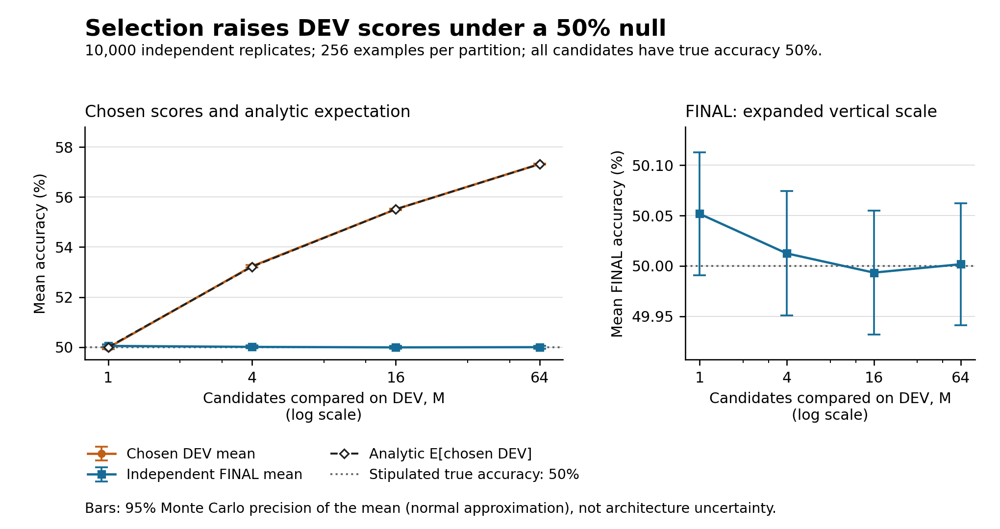

# Item 7 — Split governance, exposure audit and selection-bias simulation

Report date: 2026-10-07 UTC. Scope: item 7 only. Execution and independent artifact recounts are complete; programme closure and archival are recorded separately by the coordinator. This report makes no new model-performance claim and does not reopen H1 or begin item 8.

## 1. Result and evidential scope

The completed audit found that all nine declared partitions are internally disjoint at the directed-triple level. Across configurations, their TRAIN eligibility covers 1,319 of the 1,320 possible triples. This establishes extensive overlap in the support of different experiments; it does not establish which triples actually occurred in historical minibatches, nor contamination of a model's own training/test split. All existing study datasets remain exposed or conditional on their documented history. Item 7 has not created a historically fresh holdout.

The frozen null simulation illustrates a different issue: selecting among more noisy DEV scores can improve the selected DEV score without improving true or untouched FINAL accuracy. With all candidates stipulated to have true accuracy 50%, the observed selected DEV mean increased from 49.977266% at M = 1 to 57.318047% at M = 64, while FINAL means remained between 49.993320% and 50.051719%. Every declared condition is reported below. These numbers concern fictitious binomial candidates, not NeuroPixel or its baselines.

| Completed evidence or mechanism | What it establishes | What remains unestablished |
|---|---|---|
| Source audit of original and research data/evaluation paths | The inspected APIs, selection boundaries and known ways to bypass them | A complete historical log of human decisions or all data access |
| Exact membership export and finite-set audit | Nine internally disjoint partitions, full pairwise eligibility ledger and archived growth-list agreement | Actual historical minibatch exposure; a new population or pristine holdout |
| Opt-in manifest, development sampler and final-access contract | Enforced checks for callers that adopt the new boundary; 21 cloud tests passed | Universal enforcement through unchanged legacy APIs, independent custody or blindness |
| Preserved initial failure and corrected contract | The missing validation-denominator check was identified and fixed before freeze | That passing tests prove semantic correctness of arbitrary caller-supplied records or metrics |
| Four-condition null simulation and analytical checks | Selection optimism under the declared independent-binomial model; no analytical diagnostic flags | The size or cause of selection bias in any actual NeuroPixel result |
| Independent recounts and archive checks | Internal consistency of saved evidence, source anchors, chronology and numerical summaries | An independent laboratory replication or proof of unrecorded external non-access |

No model was trained, loaded for prediction or newly scored on final RoleTask examples in this item. Four small development-sampler tests did generate train/validation fixtures. The membership exporter enumerated pools and CPU permutations; the simulation generated abstract success counts. These scopes should not be conflated with an assertion that no data of any kind were generated.

## 2. Frozen specification and executed provenance

The governing documents are [07_protocol.md](07_protocol.md), [07_methodological_evidence.md](07_methodological_evidence.md), [07_execution_plan.json](07_execution_plan.json) and [07_cloud_export_plan.json](07_cloud_export_plan.json). Both execution plans were frozen at **2026-10-07T05:57:21.510280+00:00**. The simulation plan binds its implementation and method note; the cloud plan separately binds the contract tests and exact membership exporter. The old source audit is pinned to the closed item-6 anchor `34ec75bad57825ae71cc7772ed236efb17cfcc94`.

The executed source commit is **`0ed43bd5bb1d8bcb166b8e63e909195cbe69f769`**. The cloud raw-results archive is at the different commit **`f0aa1f17e08a495e92e7e8084003f357abfe9a8d`**, on `research/scientific-validation-2026-10-07-cloud-results`, for Actions run [37578991388](https://github.com/Agnuxo1/NeuroPixel/actions/runs/37578991388), attempt `37578991388-1`. The results commit is an archive location, not the scientific implementation revision. Its [immutable raw directory](https://github.com/Agnuxo1/NeuroPixel/tree/f0aa1f17e08a495e92e7e8084003f357abfe9a8d/results/research/07_cloud_runs/37578991388-1) contains the cloud evidence and source ZIP.

The seven historical files recorded in [06_recovery_manifest.json](06_recovery_manifest.json)—the original model/task, research models/data/experiment, research training entry point and frozen `protocol.json`—remain unchanged. The new governance code is opt-in; it does not rewrite the old task, model or training semantics. Source and archive hashes were checked against the frozen source, including the historical anchors.

| Record | SHA256 |
|---|---|
| Item-7 protocol | `8b3b44eebb0821498d3537016c847eaf3ea4ffb50607d2a0352e76f98c465f08` |
| Simulation execution plan | `77941082f44b8bf9132bea7b8371a0a388e8e700de42794b421584973b771bab` |
| Cloud export plan | `5071ae0e70d47c37e7eaea0d3f0a2299b6e3d06bf6a68337201f67c6f6ca8542` |
| Exact membership export, `split_pools.json` | `1fc03501b21b2790109b1f66e64fa0dc76a1bce1fb11f6ccd7602bc38f28918d` |
| Finite-set exposure audit | `9203b599faf4c8ae1d6c58491adb9877ec751aca08e7f5b8a439f82e51100340` |
| Simulation analysis | `9f951576690e4c3a509d1242f7e5b68681b4e9b112968cea0bd3bc9d4f776851` |
| Independent simulation recount | `2f1f200bca893c7532274eb9e356741a5d41762720ed1100bbdcde02789e98dd` |
| Independent cloud archive audit | `cd114c561b9e44c994fd1523b47f72d6200d1392a8a7ffee5013cbe41cf7ad4c` |

## 3. Exact split-membership findings

### 3.1 Unit, enumeration and within-partition results

The grouping unit is the ordered triple `(agent, verb, patient)`, with 12 noun identities, 10 verb identities and distinct agent and patient. There are `12 × 10 × 11 = 1,320` possibilities, enumerated as `[(a, v, p) for a in range(12) for v in range(10) for p in range(12) if a != p]`. The ordered-universe digest is `715bb4d57b9c0934ad916c4666228b1c31e25ad1d339cbe41be38a60899de6ad`.

This grouping keeps variants of a given directed triple in the same partition for a given configuration. It does not hold out individual noun/verb tokens, unordered noun pairs, rendering rules, places or query roles. Reversing agent and patient creates another directed group and can cross a boundary. A claim about unseen source entities or new tasks would require a different grouping and estimand. Relatedness must be assessed relative to the intended prediction unit [S6].

The legacy 80/20 split uses the first 264 entries of the seeded permutation as test and the remaining 1,056 as train. The research 70/10/20 split uses the same test slice, entries 264–395 as validation and entries 396–1,319 as train. The exported seed set was 0, 1, 2, 101 and 202. Ten direct constructor checks, one original and one research constructor per seed, agreed with the exported ordered lists. Additional constructor checks do not imply additional training runs.

| Partition | TRAIN | Validation | Test | Declared universe | Internal overlaps |
|---|---:|---:|---:|---:|---:|
| `historical80_20/seed0` | 1056 | — | 264 | 1320 | 0 |
| `prospective70_10_20/seed0` | 924 | 132 | 264 | 1320 | 0 |
| `historical80_20/seed1` | 1056 | — | 264 | 1320 | 0 |
| `historical80_20/seed2` | 1056 | — | 264 | 1320 | 0 |
| `prospective70_10_20/seed101` | 924 | 132 | 264 | 1320 | 0 |
| `prospective70_10_20/seed202` | 924 | 132 | 264 | 1320 | 0 |
| `growth_filtered/seed0/topic0` | 85 | 10 | 25 | 120 | 0 |
| `growth_filtered/seed0/topic1` | 90 | 8 | 22 | 120 | 0 |
| `growth_filtered/seed0/topic2` | 93 | 7 | 20 | 120 | 0 |

All nine checks were `disjoint_complete: true`. The growth rows filter the seed-0 research pools to noun groups 0–3, 4–7 and 8–11. Each group permits 120 triples, and all three ordered train/validation/test descriptors matched the archived item-6 [growth partitions](../../results/research/07_inputs/item6_growth_partitions.json) exactly. Filtering gives the counts above; it does not preserve exact 70/10/20 percentages within each topic. Cross-topic noun compositions are excluded. The noun sets also supply a visible lexical cue to topic membership, even without an explicit topic label.

For seed 0, the old TRAIN set equals the union of the research TRAIN and validation sets. Thus **all 132 research validation triples were previously training-eligible**, and the old and new test memberships are identical. A newly named validation directory or a new sampling seed does not change that support-level history.

### 3.2 Cross-configuration eligibility, with complete denominators

The [exposure audit](../../results/research/07_split_exposure.json) records all 24 pools and all 276 pairwise intersections. The following unions use the full 1,320-triple universe as their denominator, including for the restricted growth pool.

| Declared TRAIN union | Eligible triples | Fraction of full universe | Outside union |
|---|---:|---:|---:|
| Legacy seeds 0, 1, 2 | 1,311 / 1,320 | 99.318182% | 9 |
| Research seeds 0, 101, 202 | 1,286 / 1,320 | 97.424242% | 34 |
| Three growth topics at seed 0 | 268 / 1,320 | 20.303030% | 1,052 |
| All nine declared TRAIN pools | 1,319 / 1,320 | 99.924242% | 1 |

For every final pool, the audit separates overlap with its own TRAIN pool from overlap with other declared configurations. Counts, not percentages, are shown below; “historical” and “research” refer to the unions in the preceding table.

| Final pool | Size | Own TRAIN | Historical TRAIN union | Research TRAIN union | Growth TRAIN union | All TRAIN unions |
|---|---:|---:|---:|---:|---:|---:|
| `historical80_20/seed0/test` | 264 | 0 | 255 | 243 | 0 | 263 |
| `prospective70_10_20/seed0/test` | 264 | 0 | 255 | 243 | 0 | 263 |
| `historical80_20/seed1/test` | 264 | 0 | 255 | 259 | 54 | 263 |
| `historical80_20/seed2/test` | 264 | 0 | 255 | 257 | 54 | 263 |
| `prospective70_10_20/seed101/test` | 264 | 0 | 262 | 241 | 44 | 263 |
| `prospective70_10_20/seed202/test` | 264 | 0 | 261 | 241 | 52 | 263 |
| `growth_filtered/seed0/topic0/test` | 25 | 0 | 25 | 22 | 0 | 25 |
| `growth_filtered/seed0/topic1/test` | 22 | 0 | 22 | 18 | 0 | 22 |
| `growth_filtered/seed0/topic2/test` | 20 | 0 | 20 | 20 | 0 | 20 |

Each full 264-triple final pool has 263 triples that are eligible for training somewhere else in this collection. All 67 growth final triples are eligible in another declared configuration. The one universe index outside the combined TRAIN union is 1311; its absence from those TRAIN lists does **not** certify that it is pristine, uninspected or absent from validation/test access or other experiments.

These are finite-set eligibility statements. The audit explicitly records `actual_minibatches_audited: false`, `historical_raw_minibatches_available_here: false` and `observed_unique_training_triples: null`. It does not decode all prospective sample arrays or estimate unique exposures from budgets or stream digests. No number in this section should be relabelled “examples actually seen during training.”

Cross-split overlap is also expected in correctly prescribed cross-validation or repeated-split evaluation. Such overlap does not automatically invalidate that procedure: the relevant requirements concern what each fit and selection stage can access, and evaluation of the complete selection procedure within appropriate outer splits [S1, S2]. This audit is not a nested-CV experiment and cannot retrospectively reconstruct all researcher dependence. It does establish that repeated seeds here repartition a common finite universe rather than supplying independent new universes.

### 3.3 Runtime and historical limits

The exact export ran under **Python 3.12.8 and PyTorch 2.6.0+cpu** with one numerical and one inter-op thread. Current constructor agreement and the three archived growth membership lists provide direct checks at those boundaries. The recovered historical item-5 replication report instead records **PyTorch 2.14.1+cpu**; complete old membership lists from that and every earlier runtime are unavailable here. Accordingly, unanchored historical membership interpretations are conditional on permutation compatibility. Identical source and seed alone do not prove identical permutations across software releases. The exporter used the declared Torch implementation, not a substitute NumPy shuffle.

Knowing a generator is different from knowing the particular fresh samples used for an evaluation. Newly generated layouts can be new instances conditional on a known support, but they cannot make an already inspected finite support historically untouched. Public seeds, manifests and hashes improve reproducibility and provenance; they do not create blindness or independent custody. The exposed status of the existing datasets is retained.

## 4. Source-path audit and opt-in safeguards

### 4.1 Findings about existing evaluation paths

The [gate source audit](07_gate_source_audit.md) records the inspected paths and pinned source references. In the original `RoleTask.sample`, only the exact string `"train"` selects train; every other split name reaches test. The research sampler accepts only train/validation/test and requires an explicit CPU generator, but it still exposes test publicly. An inherited `sample_loop(..., split="validation")` path can fall back to test; no inspected research driver invoked that problematic path. This is a concrete API hazard, not evidence that items 4–6 used it.

Original `scripts/train.py` repeatedly evaluates train and test and reports `best_test`; the sweep collects best and final statistics. The saved weights are the final weights, not a checkpoint selected by `best_test`. This establishes availability of test feedback and the reported statistic, not a reconstruction of a specific human hyperparameter decision. A further generic risk is dataset naming that omits some generator/geometry/topic identities and permits atomic replacement. Existing growth directories and checked core hashes constrain the inspected uses; the generic helper alone is not a universal dataset-identity boundary.

Items 4 and 6 had explicit selection or execution gates before their final sampled examples, but those final populations already had a documented exposure history. Item 5's available continuation evidence is partly report-level recovery evidence; this item does not recreate its unavailable original replication controller or raw CPU archive. In growth, pool membership descriptors were available before training, so a “first final access” event refers to sampled final examples/scoring, not first visibility of the list of eligible triples. Growth gate fitting and allocation diagnostics used declared TRAIN data; this does not turn gate fitting into independent validation.

No data-fitted vocabulary discovery or normalization was found in the inspected task. Visible fillers and a query role belong to the task definition. Their presence is not itself an accidental target-argument leak. Those observations do not extend the audit to arbitrary future preprocessing or tasks.

### 4.2 What the new contract enforces

[split_governance.py](../../neuropixel/research/split_governance.py) binds declared groups, content, sources, vocabulary, geometry, runtime/RNG recipe, transforms, preprocessing-fit populations and exposure history into manifests. It checks declared cross-partition group/content separation, identity drift, a complete non-duplicated candidate inventory, common validation populations and denominators, and valid finite metrics. Candidate/checkpoint/configuration/source identities are checked at selection freeze and before final access. A separate immutable plan anchors the selection receipt.

The final-access receipt is durably written before the final path is resolved or read. Verified bytes are passed to the evaluator rather than reopened through an unchecked second read. A failed load or evaluation consumes the access; it does not silently restore the ability to try another final case. The current `FinalStudy` API selects and evaluates one candidate once; repeated `evaluate` calls are not a multi-case interface. A study with multiple final cases requires a separate predeclared controller and complete case inventory. The new [development adapter](../../neuropixel/research/development_data.py) exposes train/validation, rejects test/final and closes inherited loop/camera routes that would bypass that restriction.

This is an **opt-in contract**. Old public APIs and files remain available. A future controller must explicitly adopt the boundary and provide valid scientific definitions; [07_adoption.md](07_adoption.md) describes that integration. The module cannot infer whether declared groups correspond to actual semantic dependencies, whether caller-provided metrics were honestly calculated, or whether a protocol was committed before those metrics existed. It cannot prevent receipt deletion, alternate scripts, public-data reconstruction or unrecorded outside access. Unknown or exposed history is not accepted as confirmatory merely because files are copied to a new directory. These controls are not the differentially private reusable-holdout procedure of [S3].

### 4.3 Initial failure retained, correction and final test result

The first governance run had **16 passes and 1 failure out of 17**. `test_agreed_denominators_must_still_match_manifest_record_count` showed that all candidates could agree on a validation denominator while that denominator differed from the manifest's number of records. The expected rejection did not occur. The [initial log](../../results/research/07_validation/governance_initial.log) and [initial module snapshot](../../results/research/07_validation/split_governance_initial.py) are preserved.

The [correction record](../../results/research/07_validation/governance_correction.json), timestamped **05:50:16.194874 UTC**, predates the freeze and numerical outcomes. The fix requires the `all` denominator to equal the declared validation-record count and checks each candidate denominator's type/range independently. The initial module SHA256 was `c5e384391307cefd43c7a0ec7fdcf6e329f2539e22a658550a76c3b8a304cc4e`; the corrected, frozen module SHA256 is `133219c26303c03eb31d18faf7bbc2ed83da8a8ce47a8f953a2f9776cfcb595c`.

The [corrected local log](../../results/research/07_validation/governance_corrected.log) has **17/17 passes**. The frozen cloud run then has **21/21 passes**, comprising those 17 contract tests plus four development-sampler tests; the archive audit verified 21 unique JUnit cases. Initial and corrected local test times were 0.064 s and 0.062 s respectively. The earlier review's “adapter pending” field is a pre-cloud status superseded by this executed cloud evidence. These passes support the exercised contracts, not universal absence of leakage.

## 5. Frozen selection-bias simulation

### 5.1 Design, event order and estimand

There are **R = 10,000 independent Monte Carlo replicates**, **K = 64 fixed candidate IDs**, and **n = 256** abstract trials per candidate per partition. All true accuracies are stipulated to equal 0.5. TRAIN, DEV and FINAL success-count matrices are independent `Binomial(256, 0.5)` draws, using PCG64 streams seeded 71001, 71002 and 71003 respectively. NumPy **2.3.5** is asserted by the implementation. No actual classifier is fit.

Within each replicate, TRAIN ranks the 64 candidates by decreasing success count, breaking ties by lower ID. Nested shortlists have M = 1, 4, 16 or 64 members. DEV chooses the largest count within each shortlist, again breaking ties by lower global ID. All four winner IDs for every replicate are fixed and persisted before the FINAL RNG is constructed. The selection receipt was persisted at **05:59:12.680176 UTC**, before the FINAL-generation start event at **05:59:12.680448 UTC**; final generation completed at **05:59:12.844513 UTC**. Receipt SHA256: `130c1c19109582af91b1e87d09791af5585bba7906533655a5973207211f825e`.

The primary summaries are selected DEV accuracy, the same selected candidate's untouched FINAL accuracy, and their paired difference. All M conditions share candidate matrices and overlapping shortlists within a replicate, so conditions are dependent; there are 10,000 independent replicates, not 40,000 independent experiments. Candidate construction is fixed, while selection is adaptive. The design does not reproduce adaptive invention of architectures or correlated real-model errors.

### 5.2 All four condition results

Accuracy is displayed in percent; DEV − FINAL is in percentage points (pp). Tables round only for display; the [analysis JSON](../../results/research/07_simulation/20261007_01/analysis.json), [40,000-row replicate CSV](../../results/research/07_simulation/20261007_01/replicates.csv) and saved count arrays retain the evidence used in the recount.

| Shortlist M | DEV mean (%) | Analytic DEV mean (%) | FINAL mean (%) | Paired DEV − FINAL (pp) | Analytic optimism (pp) |
|---:|---:|---:|---:|---:|---:|
| 1 | 49.977266 | 50.000000 | 50.051719 | -0.074453 | 0.000000 |
| 4 | 53.233242 | 53.215098 | 50.012422 | 3.220820 | 3.215098 |
| 16 | 55.511367 | 55.513241 | 49.993320 | 5.518047 | 5.513241 |
| 64 | 57.318047 | 57.311906 | 50.001680 | 7.316367 | 7.311906 |

The uncertainty below is Monte Carlo precision under the stipulated model. SD describes the replicate distribution; MCSE is the estimated uncertainty of its simulated mean. Intervals use the frozen normal approximation `mean ± 1.96 × MCSE`. They are not confidence intervals for NeuroPixel performance, training-seed variability or the historical magnitude of selection bias.

| M | Quantity | Mean (% or pp) | Replicate SD (pp) | MCSE (pp) | 95% Monte Carlo interval for mean (% or pp) |
|---:|---|---:|---:|---:|---|
| 1 | DEV (%) | 49.977266 | 3.153530 | 0.031535 | [49.915456, 50.039075] |
| 1 | FINAL (%) | 50.051719 | 3.124211 | 0.031242 | [49.990484, 50.112953] |
| 1 | DEV − FINAL (pp) | -0.074453 | 4.418714 | 0.044187 | [-0.161060, 0.012154] |
| 4 | DEV (%) | 53.233242 | 2.233808 | 0.022338 | [53.189460, 53.277025] |
| 4 | FINAL (%) | 50.012422 | 3.149418 | 0.031494 | [49.950693, 50.074150] |
| 4 | DEV − FINAL (pp) | 3.220820 | 3.840684 | 0.038407 | [3.145543, 3.296098] |
| 16 | DEV (%) | 55.511367 | 1.705735 | 0.017057 | [55.477935, 55.544800] |
| 16 | FINAL (%) | 49.993320 | 3.137511 | 0.031375 | [49.931825, 50.054816] |
| 16 | DEV − FINAL (pp) | 5.518047 | 3.567829 | 0.035678 | [5.448117, 5.587976] |
| 64 | DEV (%) | 57.318047 | 1.420419 | 0.014204 | [57.290207, 57.345887] |
| 64 | FINAL (%) | 50.001680 | 3.094227 | 0.030942 | [49.941033, 50.062327] |
| 64 | DEV − FINAL (pp) | 7.316367 | 3.426684 | 0.034267 | [7.249204, 7.383530] |

At M = 64 the observed paired optimism is exactly **7.3163671875 pp**, with a Monte Carlo mean interval of **[7.249204180946554, 7.383530194053446] pp**. Its analytical expectation is 7.311905800099316 pp. The small negative estimate at M = 1 is retained; its analytical expectation is zero and its Monte Carlo interval includes zero. No condition or seed was chosen using FINAL.



The [PDF figure](../../results/research/07_simulation/figures/selection_optimism.pdf) and [render receipt](../../results/research/07_simulation/figures/selection_optimism.receipt.json) accompany the exact tables. The plot is a rendering of saved results, not another simulation; its initial layout and correction record are preserved separately.

### 5.3 Analytical checks and declared tail summary

Let F(k) be the CDF of a `Binomial(256, 0.5)` count and D the selected DEV accuracy. Because TRAIN is independent of DEV and all candidates share the null distribution, the DEV maximum over an M-member shortlist has count CDF `F(k)^M`. Therefore:

\[
E[D]=\frac{1}{256}\sum_{k=0}^{255}(1-F(k)^M),\qquad
E[D^2]=\frac{1}{256^2}\sum_{k=0}^{255}(2k+1)(1-F(k)^M).
\]

For selected FINAL accuracy Q, `E[Q] = 0.5` and `Var(Q) = 0.25/256 = 0.0009765625`. FINAL remains independent of the selected DEV score under this null construction. Thus `E[D−Q] = E[D]−0.5` and `Var(D−Q) = Var(D)+Var(Q)`.

The predeclared secondary tail threshold was accuracy at least 0.6, equivalent on the discrete grid to **at least 154 successes out of 256** (60.15625%). Its analytical probabilities are `1−F(153)^M` for DEV and `1−F(153)` for FINAL.

| M | DEV count / 10,000 | DEV observed (%) | DEV analytic (%) | FINAL count / 10,000 | FINAL observed (%) | FINAL analytic (%) |
|---:|---:|---:|---:|---:|---:|---:|
| 1 | 6 | 0.0600 | 0.069398 | 5 | 0.0500 | 0.069398 |
| 4 | 33 | 0.3300 | 0.277305 | 8 | 0.0800 | 0.069398 |
| 16 | 110 | 1.1000 | 1.104613 | 6 | 0.0600 | 0.069398 |
| 64 | 453 | 4.5300 | 4.345778 | 6 | 0.0600 | 0.069398 |

All 20 prescribed checks—DEV mean, FINAL mean, paired optimism mean, DEV tail and FINAL tail for each M—were within the diagnostic bounds: **zero flags**, with largest absolute standardized discrepancy **1.6846819061769494**. The rule was an absolute discrepancy strictly greater than six analytical MCSE, with no rerun or selective omission. For a tail probability q, the diagnostic MCSE is `sqrt(q(1−q)/R)` using the analytical q, not an observed estimate that could become zero when no events occur. Observed tail MCSEs are separately retained in the JSON. This is a prespecified implementation diagnostic, not a new acceptance test for a scientific model claim.

### 5.4 Independent recount and limits

The [root recount](../../results/research/07_simulation/20261007_01_root_audit.json) is `verified`, with **450,713 checks and zero issues**. It checked all 11 manifested artifacts, candidate ordering, 40,000 selected winners, 40,000 FINAL gathers, 400,000 CSV cells, source/plan anchors, receipt chronology and all analytical summaries. The independent arithmetic used exact-integer CDF-power-difference probabilities and integer-sum empirical moments rather than importing the producer. It did not regenerate random numbers. Maximum absolute numerical difference was **7.284173264565652 × 10⁻¹³**, below the declared absolute tolerance 10⁻¹² with relative tolerance zero.

The simulation demonstrates the statistical mechanism described in [S1, S2, S4] under its deliberately simple assumptions. It estimates neither the amount of adaptation in this project nor the effects of distribution shift, correlated candidate errors, unequal true accuracies or repeated researcher-designed candidates. No nested CV, bootstrap or reusable-holdout algorithm was run. A faithful recount is independent of the producer's implementation; it is not independent external custody or a laboratory replication.

## 6. Resources, artifacts and reproduction

### 6.1 Observed resource scope

| Executed component | Runtime and thread limits | Reported elapsed time | Available-memory observations |
|---|---|---:|---|
| Cloud contract tests and membership export | Ubuntu 24.04; Python 3.12.8; Torch 2.6.0+cpu; one numerical and one inter-op thread | Tests stage 2.001083681 s; export stage 2.000906057 s; worker before archive 4.227750006 s | Worker minimum 14.275299072265625 GiB across 7 samples; exporter minimum 14.275325775146484 GiB across 11 samples |
| Null simulation | Python 3.12.14; NumPy 2.3.5; one numerical thread | 0.6465705449991219 s reported by simulation | Minimum 9.109718322753906 GiB across 5 samples |

Both execution plans required at least **8 GiB available RAM**. The cloud worker had 900-second stage limits and a 35-minute workflow limit. Reported elapsed times exclude environment installation, full task preparation, archival/push and some final persistence overhead; they are not end-to-end programme costs. Available RAM samples are not process peak RSS, guaranteed continuous minima, GPU memory or energy measurements. No GPU model experiment or energy measurement was performed in item 7.

The cloud archive audit is `verified`, with **zero issues**, **10 files totalling 5,404,361 bytes excluding its manifest**, and an exact source ZIP containing 184 tracked files. It verified source and archive commit identities, frozen plan hashes, the 21 test cases and exported memberships. Its manifest SHA256 is `eecd082347f2edb7c3e9c3d21d833571802d2f9313a4082f4fd415e0a3accff1`. The manifest is not included in its own byte total. The [cloud audit](../../results/research/07_validation/cloud_archive_audit.json) records the complete inventory and limits.

### 6.2 Evidence index

| Artifact | Purpose and scope |
|---|---|
| [Protocol](07_protocol.md), [methodological evidence](07_methodological_evidence.md), [source audit](07_gate_source_audit.md) | Definitions, primary literature and pre-execution implementation inspection |
| [Simulation plan](07_execution_plan.json), [cloud plan](07_cloud_export_plan.json) | Frozen recipe, declared files, resource limits and case inventory |
| [Split exposure JSON](../../results/research/07_split_exposure.json) | All pools, pairwise intersections, same-seed relationships, ordered-list hashes and historical limits |
| [Raw cloud archive](https://github.com/Agnuxo1/NeuroPixel/tree/f0aa1f17e08a495e92e7e8084003f357abfe9a8d/results/research/07_cloud_runs/37578991388-1) | Membership export, test outputs, worker/source provenance and source ZIP |
| [Governance correction](../../results/research/07_validation/governance_correction.json), [review](../../results/research/07_validation/governance_review.json) | Preserved failure, corrected contract and pre-cloud review status |
| [Simulation analysis](../../results/research/07_simulation/20261007_01/analysis.json), [replicates](../../results/research/07_simulation/20261007_01/replicates.csv) | All four summaries and every replicate/condition row |
| [Selection counts](../../results/research/07_simulation/20261007_01/selection_counts.npz), [FINAL counts](../../results/research/07_simulation/20261007_01/final_counts.npz) | Preserved generated evidence, ordering and selected outcomes |
| [Selection receipt](../../results/research/07_simulation/20261007_01/selection_receipt.json), [events](../../results/research/07_simulation/20261007_01/events.json), [environment](../../results/research/07_simulation/20261007_01/environment.json), [artifact manifest](../../results/research/07_simulation/20261007_01/artifact_manifest.json) | Event ordering, version pinning and artifact integrity |
| [Independent simulation audit](../../results/research/07_simulation/20261007_01_root_audit.json), [archive audit](../../results/research/07_validation/cloud_archive_audit.json) | Independent numerical and archived-source verification |
| [Adoption guide](07_adoption.md) | Integration requirements for future controllers; not a claim of retroactive enforcement |

### 6.3 Reproduction boundary

The commands below document reproduction; this report did not rerun them. Simulator execution, membership export and the cloud tests use the exact frozen source commit, matching pinned software and a **new** output path. The independent simulation recount helper was added after execution for closure; it is absent from `0ed43bd5bb1d8bcb166b8e63e909195cbe69f769`. Run that helper from the audited closure checkout while pointing `--source-root` to a separate checkout of the frozen source. Existing evidence must not be overwritten. A different NumPy version is rejected for simulation execution, and a different Torch release cannot silently replace the exact membership exporter.

```bash
# From a checkout of 0ed43bd5bb1d8bcb166b8e63e909195cbe69f769:
python scripts/research_simulate_holdout_selection.py \
  --plan docs/research/07_execution_plan.json --output-dir NEW_SIMULATION_DIR

# Post-execution recount helper: use the audited closure checkout.
# FROZEN_SOURCE separately points to the exact 0ed43bd... checkout.
# This command checks saved evidence without regenerating random draws.
python AUDITED_CLOSURE/scripts/research_verify_holdout_simulation.py \
  --input SAVED_SIMULATION_DIR --source-root FROZEN_SOURCE \
  --output NEW_SIMULATION_AUDIT.json

# Back in the frozen source checkout: exact pool export under Torch 2.6.0+cpu:
python scripts/research_export_split_pools.py \
  --output NEW_POOLS.json --source-root FROZEN_SOURCE

# Audit finite memberships against the archived growth descriptor:
python scripts/research_audit_split_exposure.py \
  --permutation-export SAVED_SPLIT_POOLS.json \
  --archived-growth-partitions results/research/07_inputs/item6_growth_partitions.json \
  --source-root FROZEN_SOURCE --output NEW_SPLIT_AUDIT.json

# The 21 contract/development tests executed in the cloud:
python -m pytest -q tests/test_research_split_governance.py \
  tests/test_research_development_data.py
```

These procedures can verify or reproduce computational evidence. They cannot undo historical dataset access, replace missing historical minibatches, retroactively blind a researcher or supply a new inferential result about NeuroPixel. H1 remains closed with its previously recorded outcome.

## 7. Primary methodological sources and limits of application

All six sources below were directly consulted on **2026-10-07** for the frozen [methodological note](07_methodological_evidence.md). The propositions are paraphrases; the application to this repository is a separate methodological interpretation.

**[S1] Cawley, G. C., and Talbot, N. L. C. (2010). “On Over-fitting in Model Selection and Subsequent Selection Bias in Performance Evaluation.” JMLR 11:2079–2107.** [Primary article and PDF](https://www.jmlr.org/papers/v11/cawley10a.html); [direct PDF](https://www.jmlr.org/papers/volume11/cawley10a/cawley10a.pdf). Read §§4–5.1, especially pp. 2094–2095. Optimizing a noisy selection criterion can itself overfit; evaluation should encompass fitting and selection within its outer boundary. This supports separating development selection from final assessment. It does not quantify bias in any of the saved NeuroPixel scores.

**[S2] Varma, S., and Simon, R. (2006). “Bias in error estimation when using cross-validation for model selection.” BMC Bioinformatics 7:91.** [Primary article](https://link.springer.com/article/10.1186/1471-2105-7-91), DOI 10.1186/1471-2105-7-91. Read Background, nested-CV Results and Conclusion. Their null-data experiments show optimistic error estimates when the same CV evidence selects and evaluates a procedure; nested selection reduces this bias. This motivates evaluation of the whole selection procedure, not a blanket prohibition of cross-fold membership reuse. Item 7 performs no nested CV and cannot repair prior exposure by renaming partitions.

**[S3] Dwork, C., Feldman, V., Hardt, M., Pitassi, T., Reingold, O., and Roth, A. (2015). “Generalization in Adaptive Data Analysis and Holdout Reuse.” arXiv:1506.02629v2.** [Versioned primary record](https://arxiv.org/abs/1506.02629v2); [PDF](https://arxiv.org/pdf/1506.02629v2). Read the introduction and §4.1/Figure 1, PDF pp. 15–16. Adaptive feedback can undermine ordinary holdout guarantees; their reusable-holdout mechanism controls feedback with noise and a budget under stated assumptions. A public hash, ordinary receipt or access log does not implement that mechanism. This report cites the technical preprint that was read, not an uninspected shortened account.

**[S4] Russo, D., and Zou, J. (2016). “Controlling Bias in Adaptive Data Analysis Using Information Theory.” AISTATS, PMLR 51:1232–1240.** [Primary record](https://proceedings.mlr.press/v51/russo16.html); [PDF](https://proceedings.mlr.press/v51/russo16.pdf). Read §4.1, Proposition 1. Under its assumptions, dependence between selection and noisy estimates controls a bias bound; independence of the selected index from evaluation noise has a different implication from selection using that noise. Real candidate correlations matter. The illustrative independent-binomial simulation is not a calibrated bound for the project's actual search history.

**[S5] Recht, B., Roelofs, R., Schmidt, L., and Shankar, V. (2019). “Do ImageNet Classifiers Generalize to ImageNet?” ICML, PMLR 97:5389–5400.** [Primary PDF](https://proceedings.mlr.press/v97/recht19a/recht19a.pdf). Read §§2 and 5, PDF pp. 2–3 and 7. Their newly collected test data expose changes in accuracy while separating explanations involving sampling/distribution differences and adaptive reuse. A performance drop on a new test is not, by itself, proof that adaptivity caused it; their findings do not prove that all adaptive reuse is harmless. No new ImageNet-like collection or distribution-shift test was conducted here.

**[S6] Kapoor, S., and Narayanan, A. (2022). “Leakage and the Reproducibility Crisis in ML-based Science.” arXiv:2207.07048v1.** [Versioned primary record](https://arxiv.org/abs/2207.07048v1); [PDF](https://arxiv.org/pdf/2207.07048v1). Read §2.4, categories L1.4 and L3.2, PDF pp. 5–6. Related observations or duplicated information can make an evaluation fail to represent the intended new-unit generalization claim. The appropriate boundary depends on the target use and dependence structure. The inspected source was the 2022 preprint v1; no claim is made to have read a later journal version. This motivates the explicit directed-triple scope rather than a claim of independence for every renderer, token or task variant.
