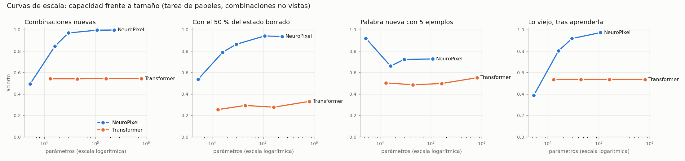

# NeuroPixel · Fase 3 «lienzo vivo» — informe

## 9 · Curvas de escala

| modelo | semillas | params | combos_nuevas | combos_rango | daño50 | palabra_nueva_k5 | viejo_tras_palabra | segundos |
|---|---|---|---|---|---|---|---|---|
| np5k | 1 | 5296 | 0.494 |  | 0.5365 | 0.919 | 0.3868 | 2928.0 |
| np14k | 1 | 16160 | 0.845 |  | 0.7895 | 0.6602 | 0.8018 | 6460.0 |
| np30k | 2 | 29824 | 0.969 | 0.954–0.984 | 0.8635 | 0.7224 | 0.9173 | 3533.5 |
| np105k | 1 | 108224 | 0.995 |  | 0.9415 | 0.7266 | 0.9726 | 12368.0 |
| np230k | 1 | 235776 | 0.9965 |  | 0.936 |  |  | 13172.0 |
| tf12k | 1 | 13043 | 0.542 |  | 0.2545 | 0.5038 | 0.5358 | 1255.0 |
| tf44k | 2 | 44483 | 0.5417 | 0.538–0.5455 | 0.2933 | 0.4863 | 0.5351 | 846.0 |
| tf170k | 1 | 162659 | 0.5445 |  | 0.277 | 0.4976 | 0.5358 | 1778.0 |
| tf800k | 1 | 810531 | 0.543 |  | 0.331 | 0.5522 | 0.5335 | 4026.0 |



## 5 · Composición lejana (papel y relleno separados, lienzo 12×12)

| modelo | params | combos_nuevas | entrenamiento | AGENTE | ACCION | PACIENTE | LUGAR | segundos |
|---|---|---|---|---|---|---|---|---|
| neuropixel_s0 | 29824 | 0.659 | 0.6365 | 0.3885 | 0.9612 | 0.3739 | 0.8587 | 14482 |
| np_big_reposo_s0 | 108224 | 0.743 | 0.754 | 0.4522 | 1.0 | 0.4622 | 1.0 | 5560 |
| np_reposo_s0 | 29824 | 0.707 | 0.6975 | 0.4013 | 0.9689 | 0.4118 | 0.9851 | 11896 |
| tf_big_s0 | 319907 | 0.561 | 0.801 | 0.0743 | 1.0 | 0.0714 | 1.0 | 5200 |
| tf_small_s0 | 48323 | 0.564 | 0.8055 | 0.0743 | 1.0 | 0.084 | 1.0 | 2671 |

## 3 · Memoria persistente (hechos de uno en uno, pregunta tras N fotogramas vacíos; entrenado hasta 8)

| modelo | params | retraso0 | retraso4 | retraso8 | retraso12 | retraso16 | retraso24 | retraso32 |
|---|---|---|---|---|---|---|---|---|
| neuropixel | 29824 | 0.992 | 0.987 | 0.965 | 0.861 | 0.695 | 0.44 | 0.316 |
| gru | 49067 | 0.77 | 0.791 | 0.785 | 0.781 | 0.768 | 0.746 | 0.729 |

## 1 · Estado de reposo (acierto según pasos de pensamiento; daño del 50 % en el paso 8)

| config | pasos8 | pasos16 | pasos24 | pasos32 | pasos48 | pasos64 | daño50_t8_pasos16 | daño50_t8_pasos32 | daño50_t8_pasos48 |
|---|---|---|---|---|---|---|---|---|---|
| fijo16_s0 | 0.998 | 0.984 | 0.8625 | 0.6745 | 0.377 | 0.227 | 0.9045 | 0.566 | 0.293 |
| reposo_s0 | 0.992 | 0.996 | 0.995 | 0.9925 | 0.982 | 0.958 | 0.9935 | 0.988 | 0.97 |

## 4 · Crecimiento automático por resonancia (temas 0,1,2 y repaso del 0)

- Lienzos creados: **2** (esperado 3; el repaso no debe crear otro)
  - tema 0: resonancias [] umbral 0.7128 → lienzo nuevo
  - tema 1: resonancias [0.7257] umbral 0.7128 → repasa lienzo 0
  - tema 2: resonancias [0.7236] umbral 0.7128 → repasa lienzo 0
  - tema 0: resonancias [0.682] umbral 0.7128 → lienzo nuevo
- Acierto final por tema (enrutado por escáner): tema 0: 0.9325, tema 1: 0.4775, tema 2: 0.9045
- Un solo lienzo en secuencia (olvido): tema 0: 0.985, tema 1: 0.4955, tema 2: 0.4935

## 6 · Energía (penalizar actividad)

| lambda | acierto | pixeles_activos_final | actualizaciones_activas |
|---|---|---|---|
| 0.3 | 0.999 | 1.0 | 1.0 |
| 1.0 | 0.996 | 1.0 | 0.7217 |
| 3.0 | 0.991 | 1.0 | 0.4929 |

## 2 · Palabra nueva sin olvido

**np_lens30k** (viejo antes: 0.9795)

| método | k1_nueva | k1_viejo | k5_nueva | k5_viejo |
|---|---|---|---|---|
| simple | 0.931 | 0.846 | 0.9 | 0.813 |
| norma | 0.077 | 0.9765 | 0.986 | 0.926 |
| repaso | 0.334 | 0.978 | 0.55 | 0.9735 |
| norma+repaso | 0.357 | 0.9755 | 0.743 | 0.977 |

**np_reposo** (viejo antes: 0.996)

| método | k1_nueva | k1_viejo | k5_nueva | k5_viejo |
|---|---|---|---|---|
| simple | 0.669 | 0.979 | 0.924 | 0.948 |
| norma | 0.304 | 0.9955 | 0.818 | 0.9605 |
| repaso | 0.217 | 0.996 | 0.738 | 0.9935 |
| norma+repaso | 0.128 | 0.9955 | 0.703 | 0.993 |

## 7 · Coste por respuesta frente a un LLM local

```
{
 "neuropixel": {
  "params": 29824,
  "acierto": 0.995,
  "ms_por_respuesta_en_lote": 0.22753,
  "latencia_1_ms": 8.88,
  "flops_por_respuesta": 56295424,
  "cpu_ms_por_respuesta_en_lote": 0.704,
  "cpu_latencia_1_ms": 5.73,
  "cpu_acierto": 0.995
 },
 "qwen2_494m_cpu": {
  "params": 494000000.0,
  "acierto": 0.94,
  "ms_por_respuesta": 279.4,
  "tokens_por_respuesta": 159.9,
  "flops_por_respuesta_aprox": 158020720000
 }
}
```

## 8 · Imaginación (rellenar un hueco con algo plausible)

```
{
 "plausible_categoria_correcta": 1.0,
 "exacto": 0.0775,
 "azar_exacto_aprox": 0.095,
 "diversidad_5_muestras": 4.1
}
```

